# EnergyComunitiesPlatform 

## Introduction

**[Glossary](/documentation/Glossary.md)**


To ensure we align our development efforts with your vision, we’d like to clarify a few key aspects of the project scope, architecture, and data integration. Your input on the following questions will help us deliver a solution that meets your needs effectively.

## Q&A:
Q: How many dataset variations can exist? (Is every dataset a diferent variation or some have the same atributes)
A: Each dataset if diferent but certain atributes represent the same context value so they can be used in the same alghoritm:

- PPV_capacity: Max fotovoltaic energy geration capacity per hour
 
- PL: Load profile of a user along the day 

- buysell: The price of electricity bought from the grid

- buysell: The price of electricity sold to the grid

- ESS-Param: Energy Storage System parameters

Q: Regarding the unused input data in the sampleData file (e.g., Pev, Physical_Distance, EV-Param, etc.), should these be considered for inclusion in the project’s development scope, or should we prioritize building a product based solely on the data and functionality currently utilized by the optimization algorithm?

Q: Will the backend domain model be designed to represent only the results of the optimization algorithm, or should it also include the input data? In other words, are we aiming for a system where the optimization algorithm is accessed solely through APIs, with standardized formats for both input and output data?

Q: In addition to Excel/CSV files, what other methods will the optimization algorithm use to receive data? For example, should it be designed to directly access an organization’s or energy community’s database?

Q: The current algorithm supports multiple prosumers (nPlayers). Should the system be designed with scalability in mind to handle a growing number of prosumers or energy communities, and if so, are there specific performance or capacity targets we should aim for (e.g., maximum number of users, processing time)?

Q: How do you envision end-users interacting with the system? For example, should we include a user interface to input data, view optimization results (e.g., `P_buy`, `P_sell`, `SOC`), or adjust parameters, or will the system primarily operate as a backend service with outputs delivered via files or APIs?

## Notes
- Create plots to compare a prosumer inside and outside an energy community
- Study how tax is applied in Spain (sampleData)
- Study how to deploy the optimization algorithm 
- Study which calls the backend has to make to use the O.A

## System Interation:

1º Dataset 

2º Read Datasets 

3º Optimize Data

4º Calculate prices and results

5º Return Arrays with results

## Code Modifications

**Detailed results path changed from absolute to relative**

The use of an absolute path turns the use of the file specific to each computer, so I added the sample data in the project repository so the code can use the path of the file within the repo (relative path). 

satcomm-scen4.py: Line 245

From
~~~
detailed_results_path = r"D:\My Projects\Satcomm project\detailed_results.xlsx"
~~~

To 
~~~
detailed_results_path = r"sampledata.xlsx"
~~~~

sampleData.xlsx: prosumers section


## Interface:
Download the installer at 'https://www.python.org/downloads/' and follow the ins
2º Create an account and Get Academic license for 1 year at https://portal.gurobi.com/iam/licenses/list/

3º Download the gurobi.lic file and follow these instructions:
    #Open Windows PowerShell as an admin (mouse right click)

    # Create folder (in case it doesn't exist)
    mkdir C:\gurobi  

    # Move the license to the correct folder (copy the path of the gurobi.lic downloaded file)
    Move-Item "C:\Users\phenr\Downloads\gurobi.lic" "C:\gurobi\gurobi.lic"

    #Update the ambient variable:
    setx GRB_LICENSE_FILE "C:\gurobi\gurobi.lic"

    #Close the terminal, reopen and run:
    grbprobe

    #It should show the license data

## Install GLPK

**1º** - Download the file 'glpk-4.35.tar.gz' at 'https://ftp.gnu.org/gnu/glpk/'

**2º** - Extract the Zip folder by: right clicking on the folder and then>> 7-Zip >> Extract Here as shown. Move the glpk-4.65 folder from your downloads folder to your C: drive.

**3º** - Assuming you’re using 64-bit Windows, click on the C:\glpk-4.65 folder in Windows explorer, click on the w64 folder, and select and copy the file path, which should be C:\glpk-4.65\w64.

**4º** - Search and open your Control Panel, select System and Security>>System>>Advanced system settings>>Environment Variables. Then click on ‘path’ in the top window, click the ‘Edit’ button, then ‘New’.

**5º** - Paste the file path you copied above and save.

## Install Libraries 
Finally run:

    py satcomm-scen4.py

DONE.

---

## Optimization Algorithm Description

### Variables Mapping

The table below maps the original variables from the code to more comprehensible names, along with their meanings in the context of the energy optimization model:

| **Original Variable**           | **New Name**             | **Meaning**                                          |
|---------------------------------|--------------------------|-----------------------------------------------------|
| `P_Load`                       | `UserDemand`             | Energy required by the user in the interval         |
| `PPV_capacity`                 | `MaxSolarProduction`     | Maximum energy generated by the solar panel         |
| `P_PV_load`                    | `EnergyForDemand`        | Solar energy used directly for demand               |
| `P_PV_ESS`                     | `EnergyForBattery`       | Solar energy used to charge the battery             |
| `P_ESS_ch`                     | `BatteryCharge`          | Energy charged into the battery                     |
| `P_ESS_dch`                    | `BatteryDischarge`       | Energy discharged from the battery                  |
| `I_ESS_ch`                     | `BatteryCharging`        | Indicator that the battery is charging              |
| `I_ESS_dch`                    | `BatteryDischarging`     | Indicator that the battery is discharging           |
| `SOC`                          | `ChargeLevel`            | Current level of energy stored in the battery       |
| `P_buy`                        | `EnergyPurchased`        | Energy purchased from the grid                      |
| `P_sell`                       | `EnergySold`             | Energy sold to the grid                             |
| `P_peer_in`                    | `EnergyReceived`         | Energy received from another user in the community  |
| `P_peer_out`                   | `EnergySent`             | Energy sent to another user in the community        |
| `Cbuy`                         | `PurchasePrice`          | Price per kW/h to buy from the grid                 |
| `Csell`                        | `SellingPrice`           | Price per kW/h to sell to the grid                  |
| `ESSparams[1, PL]`             | `ChargeEfficiency`       | Efficiency when charging the battery                |
| `1/ESSparams[1, PL]`           | `DischargeEfficiency`    | Efficiency when discharging the battery             |
| `ESSparams[2, PL] * ESSparams[3, PL]` | `MaxCapacity`      | Maximum charge/discharge capacity of the battery    |
| `ESSparams[4, PL]`             | `MinLevel`               | Minimum charge level of the battery                 |
| `SOC_end_of_day`               | `FinalChargeLevel`       | Charge level at the end of the day                  |

---

### Fluxogram
**Level 1**
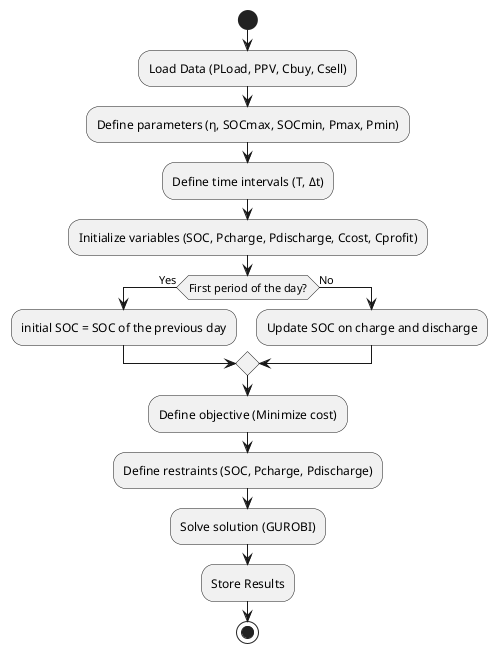

**Level 2**

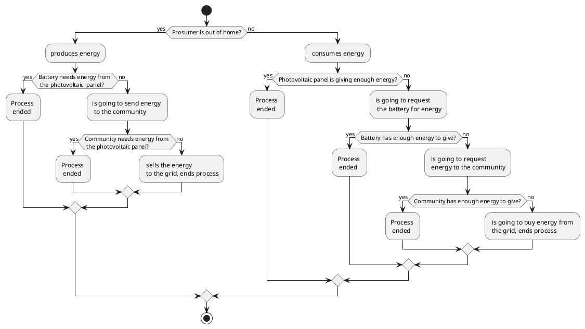

**Level 2B**
```plantuml
@startuml 
    package "Photovoltaic Panel"{
        object p_pv_load as "Photovoltaic Load"{
            * P_Pv_Load()
        }
    }
    
    package "Prosumer"{
        object P as "Prosumer Load"{
            * P_Load()
        }
    }
   

    package "Battery" {
        object b_ch as "Charge"{
            * Ess_Charge()
        }

        object b_dch as "Discharge"{
            * Ess_Discharge()
        }
    }

    package "Grid" {
        object g_buy as "Buy energy"{
            * P_Buy()
        }
        object g_sell as "Sell energy"{
            * P_Sell()
        }
    }

    package "Community" {
        object peer_out as "Send energy"{
            * Peer_Out()
        }
        object peer_in as "Receive energy"{
            * Peer_In()
        }
    }
    diamond dia1
    diamond dia2
    diamond dia3
    p_pv_load --> P: "Prosumer is consuming energy"
    p_pv_load --> b_ch: "Prosumer is not consuming energy"
    b_dch --> dia1
    peer_out --> dia1
    g_buy --> dia1
    dia1 --> P: "Prosumer needs more energy"
    b_dch --> dia2
    p_pv_load --> dia2
    dia2 --> peer_in: "Community needs energy"
    p_pv_load --> dia3
    b_dch --> dia3
    dia3 --> g_sell: "Best case, nobody needs energy"
@enduml
```

**Level 3**

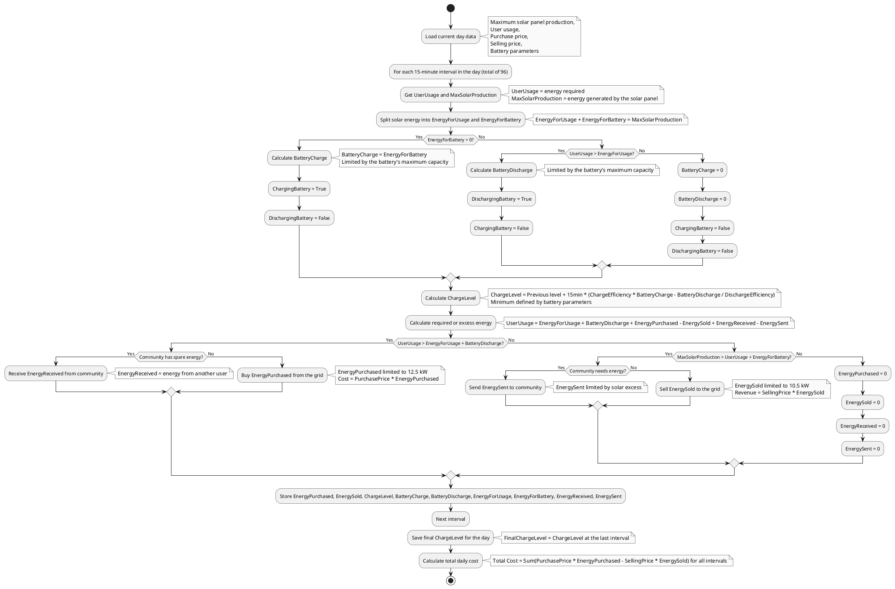
**Level 3B**

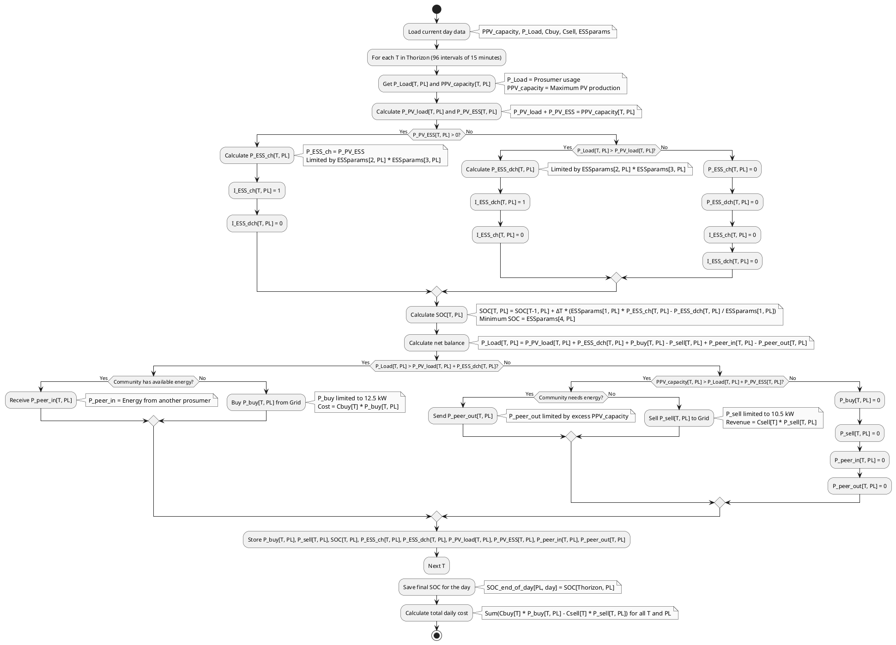


## Explanation of the Revised Flowcharts

The revised flowcharts describe the energy management process for a prosumer. Below is a detailed explanation of each step:

### Data Loading
Initial data, such as solar production (`MaxSolarProduction`), user demand (`UserDemand`), purchase and selling prices (`PurchasePrice` and `SellingPrice`), and battery parameters (e.g., `ChargeEfficiency`, `MaxCapacity`), are loaded for the day.

### Loop by Intervals
The process repeats for each 15-minute interval, totaling 96 intervals per day.

### Solar Energy Division
The energy generated by the solar panel (`MaxSolarProduction`) is split between:
- Directly meeting the user’s demand (`EnergyForDemand`).
- Charging the battery (`EnergyForBattery`).

### Battery Management
- **If there is energy for the battery** (`EnergyForBattery > 0`): The battery is charged (`BatteryCharge`), and the `BatteryCharging` indicator is activated.
- **If demand exceeds available energy** (`UserDemand > EnergyForDemand`): The battery is discharged (`BatteryDischarge`), and the `BatteryDischarging` indicator is activated.
- The `ChargeLevel` is updated based on the charging (`BatteryCharge`) and discharging (`BatteryDischarge`) actions, considering efficiencies (`ChargeEfficiency` and `DischargeEfficiency`).

### Energy Balance
Calculates whether there is a need for extra energy or a surplus, using the equation:
- `UserDemand = EnergyForDemand + BatteryDischarge + EnergyPurchased - EnergySold + EnergyReceived - EnergySent`.

### Transactions with Community and Grid
- **Energy Deficit**:
  - Attempts to receive energy from the community (`EnergyReceived`) if available.
  - Otherwise, purchases from the grid (`EnergyPurchased`), with cost calculated as `PurchasePrice * EnergyPurchased`.
- **Energy Surplus**:
  - Sends energy to the community (`EnergySent`) if needed.
  - Otherwise, sells to the grid (`EnergySold`), generating revenue as `SellingPrice * EnergySold`.

### Results
Stores all calculated variables (`EnergyPurchased`, `EnergySold`, `ChargeLevel`, etc.) for analysis. At the end of the day, calculates the total cost/revenue based on prices and transactions.

---


## Preconized Solution

### Use Case Diagram

**Level 1 - Version 1 (Functional Code)**

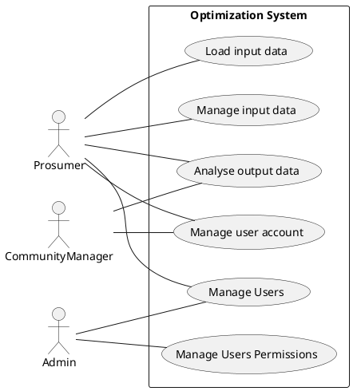
**Level 1 - Version 2**

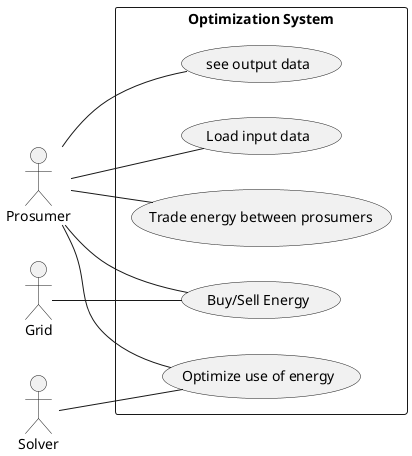

**Level 2 - Version 1**

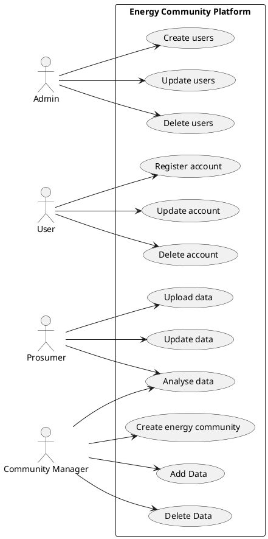

**Level 2 - Version 2**

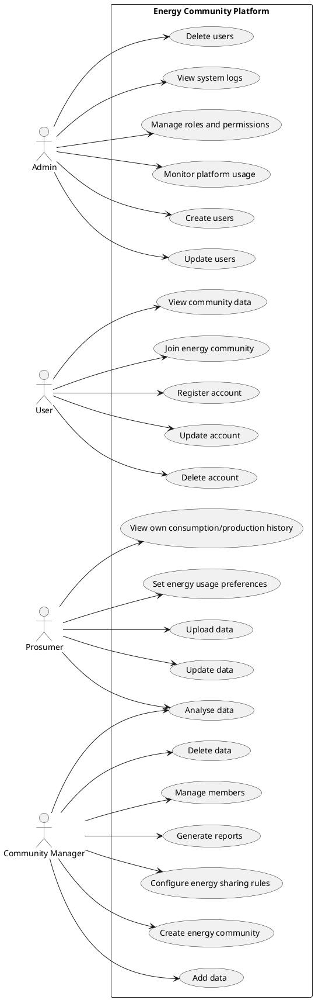

**Level 3 - Version 1**

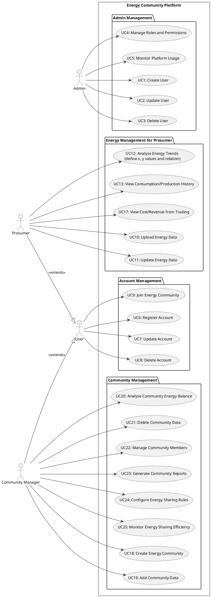
**Level 3 - Version 2**

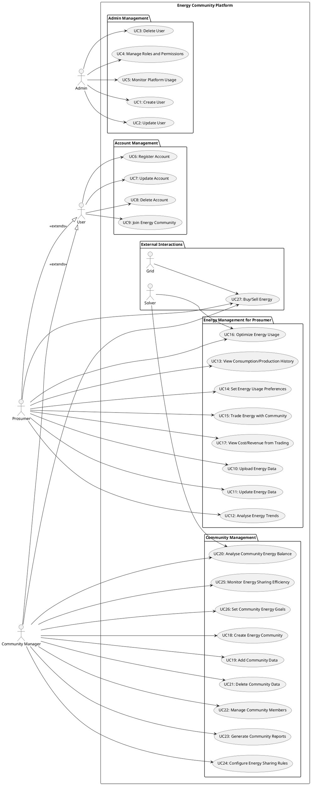

### Domain Model

**DDD based on currently functional system**

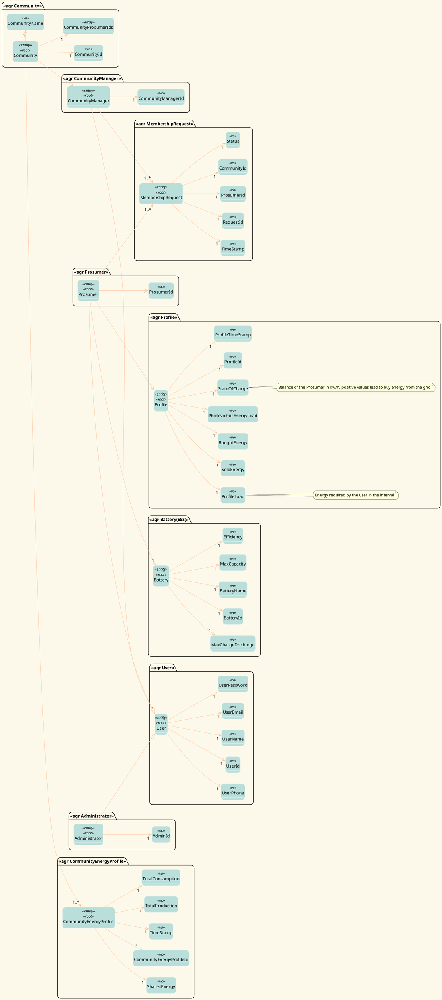


**Energy Community Platform DDD (without electric car and prosumers distances concepts)**

```plantuml
@startuml 

hide circle
hide fields
' ======= layout =========
skinparam backgroundColor #fcf9ea
skinparam titleBorderRoundCorner 15
skinparam titleFontSize 30
skinparam classAttributeIconSize 0
skinparam titleFontName Arial Black
skinparam titleFontColor #f8a978
skinparam roundcorner 20
skinparam stereotypeCBackgroundColor ffc5a1
left to right direction

skinparam class {

ArrowColor ffc5a1
BorderColor White
BackgroundColor badfdb
BackgroundColor<<Event>> skyblue
BackgroundColor<<Service>> Moccasin
}
left to right direction

package "<<agr Prosumer>>"{
    class Prosumer<<entity>><<root>>{}
    class ProsumerId<<vo>>{}
    class ProsumerDescription<<vo>>{}

    Prosumer --> "1" ProsumerId
    Prosumer --> "0..1" ProsumerDescription
    
}

package "<<agr Profile>>"{
    class Profile<<entity>><<root>>{

    }
    class ProfileId<<vo>>{}
    class ProfileTimeStamp<<vo>>{}
    class ProfileValue<<vo>>{}  
    note right{
        Balance of the Prosumer in kw/h, positive values lead to buy energy from the grid
    }

    Prosumer --> "1" Profile
    Profile --> "1" ProfileTimeStamp
    Profile --> "1" ProfileId
    Profile --> "1" ProfileValue
}

package "<<agr Grid>>"{
    class Grid <<entity>><<root>>{}
    class GridId<<vo>>{}
    class GridName<<vo>>{}

    Grid --> "1" GridId
    Grid --> "1" GridName
}

package "agr GridExchange>>"{
    class GridExchange <<entity>><<root>>{}
    class GridExchangeId<<vo>>{}
    class GridExchangeTimeStamp<<vo>>{}
    class GridExchangeBuy<<vo>>{}
    class GridExchangeSell<<vo>>{}
    class GridExchangePriceBuy<<vo>>{}
    class GridExchangePriceSell<<vo>>{}

    GridExchange ---> "1" Grid
    GridExchange ---> "1" Prosumer
    GridExchange ---> "1" GridExchangeId
    GridExchange ---> "1" GridExchangeTimeStamp
    GridExchange ---> "1" GridExchangeBuy
    GridExchange ---> "1" GridExchangeSell
    GridExchange --> "1" GridExchangePriceBuy
    GridExchange --> "1" GridExchangePriceSell
}

package "<<agr Community>>"{
    class Community<<entity>><<root>>{

    }
    class CommunityId<<vo>>{}
    class CommunityName<<vo>>{}
    class CommunityProsumers<<array>>{
    }
    Community --> "1" CommunityId
    Community -> "1" CommunityName
    Community --> "1" CommunityProsumers
}

package "<<agr CommunityExchange>>"{
    class CommunityExchange<<entity>><<root>>{}
    class CommunityExchangeId<<vo>>{}
    class CommunityExchangeTimeStamp<<vo>>{}
    class CommunityExchangePeerIn<<vo>>{}
    class CommunityExchangePeerOut<<vo>>{}

    CommunityExchange --> "1" Community
    CommunityExchange --> "1" Prosumer
    CommunityExchange --> "1" CommunityExchangeId
    CommunityExchange --> "1" CommunityExchangeTimeStamp
    CommunityExchange --> "1" CommunityExchangePeerIn
    CommunityExchange --> "1" CommunityExchangePeerOut
}

package "<<agr User>>"{
    class User<<entity>><<root>>{

    }
    class UserId<<vo>>{}
    class UserName<<vo>>{}
    class UserEmail<<vo>>{}
    class UserPassword<<vo>>{}
    class UserPhone<<vo>>{}

    User --> "1" UserId
    User --> "1" UserName
    User --> "1" UserEmail
    User --> "1" UserPassword
    User --> "1" UserPhone
    Community --> "1" User
    Prosumer --> "1" User
}

package "<<agr Administrator>>"{
    class Administrator<<entity>><<root>>{

    }
    Administrator --|> User
   
}

package "<<agr CommunityManager>>"{
    class CommunityManager<<entity>><<root>>{}
     CommunityManager --|> User
}

package "<<agr Photovoltaic Panel>>"{
    class PhotovoltaicPanel<<entity>><<root>>{
    }
    class PhotovoltaicID<<vo>>{}
    class PhotovoltaicName<<vo>>{}

    PhotovoltaicPanel --> "1" PhotovoltaicID
    PhotovoltaicPanel --> "1" PhotovoltaicName
    Prosumer --> "1" PhotovoltaicPanel
}

package "<<agr Photovoltaic Energy>>"{
    class PhotovoltaicEnergy<<entity>><<root>>{}
    class PhotovoltaicEnergyId<<vo>>{}
    class PhotovoltaicEnergyTimeStamp<<vo>>{}
    class PhotovoltaicEnergyLoad<<vo>>{}
    class PhotovoltaicEnergyBattery<<vo>>{}

    PhotovoltaicEnergy --> "1" PhotovoltaicPanel
    PhotovoltaicEnergy --> "1" PhotovoltaicEnergyId
    PhotovoltaicEnergy --> "1" PhotovoltaicEnergyTimeStamp
    PhotovoltaicEnergy --> "1" PhotovoltaicEnergyLoad
    PhotovoltaicEnergy --> "1" PhotovoltaicEnergyBattery
}

package "<<agr Battery(ESS)>>"{
    class Battery<<entity>><<root>>{}
    class BatteryId<<vo>>{}
    class BatteryName<<vo>>{}
    class MaxCapacity<<vo>>{}
    class Efficiency<<vo>>{}
    class MaxChargeDischarge <<vo>>{}
    class InitialCapacity <<vo>>{}
    class TimeStamp <<vo>>{}

    Prosumer --> "1" Battery
    Battery --> "1" BatteryId
    Battery --> "1" BatteryName
    Battery --> "1" MaxCapacity
    Battery --> "1" Efficiency
    Battery --> "1" MaxChargeDischarge
    Battery --> "1" InitialCapacity
    Battery --> "1" TimeStamp 

/'     note right of MaxCapacity 
    Represents the Cap values for each ESS.
    end note

    note right of EfficiencyCharge
    Represents the Eta values for charging efficiency.
    end note

    note right of EfficiencyDischarge
     Represents the Eta values for discharging efficiency (if modeled separately).
     end note

    note right of MinimalSOC
      Could represent a minimum state of charge (not explicitly provided in your data but could be relevant).
    end note
 '/


}

package "<<agr BatteryEnergy>>"{
    class BatteryEnergy<<entity>><<root>>{}
    class BatteryEnergyId<<vo>>{}
    class BatteryEnergyState<<vo>>{}
    class BatteryEnergyCharge<<vo>>{}
     note right{
        this value will be equal to the value provided by PhotovoltaicEnergyBattery
    }
    class BatteryEnergyDischarge<<vo>>{}
    class BatteryEnergyTimeStamp<<vo>>{}
    class BatteryEnergyDischargeBinary<<vo>>{}
     note right{
        value in binary to acknowledge the battery is discharging
    }
    class BatteryEnergyChargeBinary<<vo>>{}
     note right{
        value in binary to acknowledge the battery is charging
    }

    BatteryEnergy ---> "1" Battery
    BatteryEnergy --> "1" BatteryEnergyId
    BatteryEnergy --> "1" BatteryEnergyState
    BatteryEnergy --> "1" BatteryEnergyCharge
    BatteryEnergy --> "1" BatteryEnergyDischarge
    BatteryEnergy --> "1" BatteryEnergyTimeStamp
    BatteryEnergy --> "1" BatteryEnergyDischargeBinary
    BatteryEnergy --> "1" BatteryEnergyChargeBinary

}
@enduml


```

### Class Diagram

Level 1

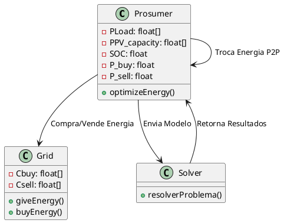

Level 2

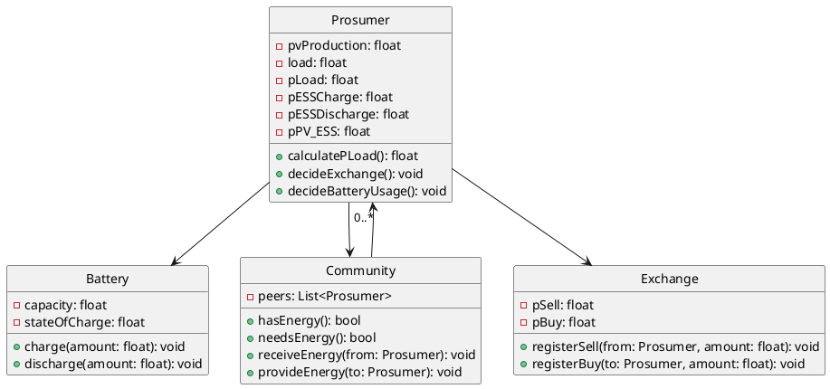

**Level 3 - Version 1**
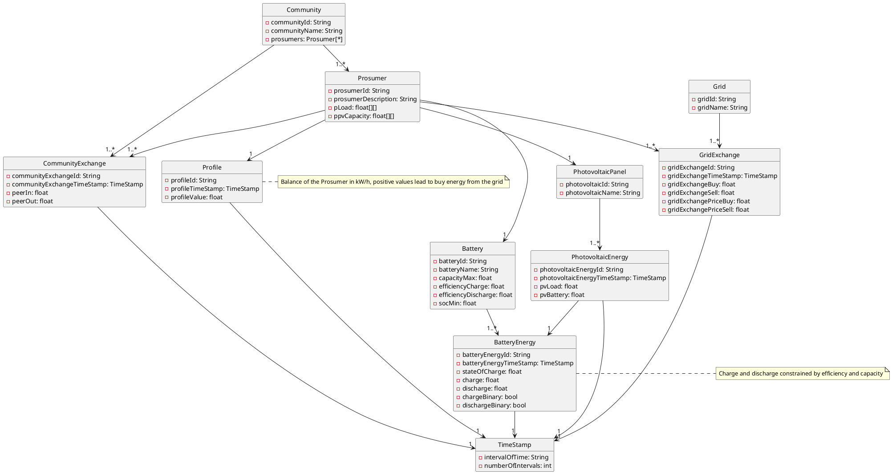

**Level 3 - Version 2**
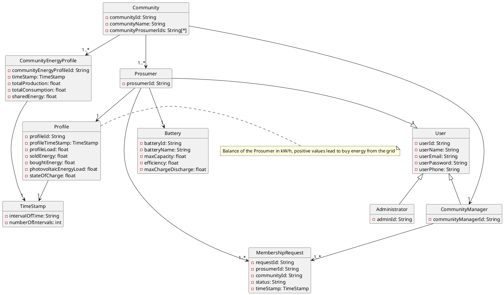


### Logical View
#### Version 1


**Backend**

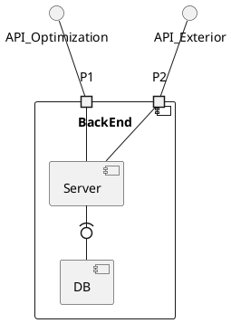
**Level 1**
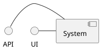


**Level 2**

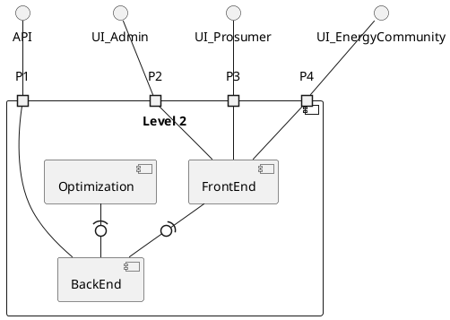


**Server**
```plantuml
@startuml 

interface API_Optimization
interface API_Exterior
interface DB

component "Server" {
component Controllers
component Domain
component Services
component Repositories
component Authorizer
component Dto
component Logs 
component Mapper

Controllers -(0- Services
Services -(0- Domain
Services -(0- Authorizer
Services -(0- Logs
Services -(0- Mapper
Mapper -(0- Dto
Repositories -0)- Services


port P1
port P2
port P3

}


P2 -- Repositories
API_Exterior -- P1
P1 -- Controllers
DB -- P2
API_Optimization -- P3
P3 -- Services


@enduml
```
Version 2 

**Level 1** 
```plantuml
@startuml
    component SATCOMM <<Context C4>>{
        port p1 as " "
    }
    interface UI_User
    interface UI_Administrator
    UI_User --> p1
    UI_Administrator --> p1
@enduml
```

**Level 2** 
```plantuml
@startuml
component SATCOMM <<Container (C4)>>{
    port p1 as " "
    component View_UI as "View (UI)" <<Container (C4)>>{
        port p2 as " "
        port p5 as " "
        port p6 as " "
        port p10 as " "
    }
    component Authentication <<Container (C4)>>{
        port p3 as " "
        port p7 as " "
    }
    component EM as "Energy Management" <<Container (C4)>>{
        port p4 as " "
        port p8 as " "
        port p11 as " "
    }
    component OTAPI as "Optimization" <<Container (C4)>>{
        port p9 as " "
        port p12 as " "
    }
    interface OtimizationAPI as "Optimization API"
    interface AuthAPI as "Authentication API"
    p5 --- AuthAPI
    AuthAPI --- p7
    interface EMAPI as "Energy Management API"
    p6 --- EMAPI
    EMAPI --- p8
    p3 -- EMAPI
    EMAPI -- p4
    p10 -- OtimizationAPI
    OtimizationAPI --- p9
    p11 -- OtimizationAPI
    OtimizationAPI -- p12

}

p1 -- p2
interface UI_User as "UI User"
interface UI_Administrator as "UI Administrator"
UI_User -- p1
UI_Administrator -- p1


@enduml
````

**Level 3**
```plantuml
@startuml
    skinparam linetype normal
    component EM as "Energy Management" <<Container (C4)>>{
        port p1 as " "
        port p2 as " "
        port p3 as " "
        folder FD as "Frameworks and Drivers Layer"{
            component Routing <<Container (C4)>>
            component Persistence <<Container (C4)>>
        }
        interface Controller_API as "Controller API"
        interface DMAPI as "Data Model API"
        interface PAPI as "Persistence API"
        Persistence -right- PAPI
        
        component Data_Model as "Data Model" <<Container (C4)>>
        Persistence -- DMAPI
        DMAPI -right- Data_Model
        folder IA as "Interface Adapters Layer"{
            component Controller <<Container (C4)>>
            component Repository <<Container (C4)>>
        }
        interface REPOAPI as "Repository API"

        folder AB as "Application Business Rules"{
            component AS as "Application Service" <<Container (C4)>>
        }
        Repository -- REPOAPI
        REPOAPI -- AS

        interface ASAPI as "App Service API"

        Controller --- ASAPI
        ASAPI -- AS

        interface DTOAPI as "DTO API"

        component DTO <<Container (C4)>>

        folder EB as "Enterprise Business Rules"{
            component DomainModel as "Domain Model" <<Container (C4)>>
        }

        interface ModelAPI as "Model API"

        Repository -- ModelAPI
        ModelAPI -- DomainModel
        Controller -- DTOAPI
        DTOAPI -- AS
        DTOAPI -left- DTO
        DMAPI -- Repository
        PAPI -- Repository
        Routing -right- Controller_API
        Controller_API -- Controller
    }
    interface AuthAPI as "Authentication API"
    interface OptimizationAPI as "Optimization API"
    interface EMAPI as "Energy Management API"
    p1 -up- EMAPI
    interface SGBDAPI as "SGBD API"
    p2 -up- SGBDAPI
    p1 -- Routing
    p3 -up- AuthAPI
    p3 -up- OptimizationAPI
@enduml
````


### Layers Diagram
#### Version 1

**View**

````plantuml
@startuml
'https://plantuml.com/component-diagram


package "Frameworks & Drivers" {
    component Database
    component Routing
}


package "Interface Adapters"{
    component Repositories
    component Controllers
}


Routing ..> Controllers
Database <.. Repositories

package "Application Business Rules"{
    component Services
}

Controllers ..> Services

package "Enterprise Business Rules"{
    component Domain
    component IRepositories
}

Services ..> Domain
Services ..> IRepositories
Repositories ..|> IRepositories

@enduml
````

**Layout**

```plantuml
@startuml
'https://plantuml.com/component-diagram


package "Frameworks & Drivers" {
    component Database
    component Routing
}

component DTO
component Data_Model

Database -- Data_Model_API
Database -- Database_Driver_API
Data_Model_API - Data_Model
Routing -- DTO_API
Routing -- Controller_API
DTO_API - DTO


package "Interface Adapters"{
    component Repositories
    component Controllers
}

Controller_API -- Controllers
DTO_API -- Controllers
Data_Model_API -- Repositories
Database_Driver_API -- Repositories
Controllers -- Service_API
Repositories -- Repo_API
Repositories -- Model_API
'Controllers -- VO_API
'Repositories -- VO_API

package "Application Business Rules"{
    component Services
}

'VO_API -- Services
Service_API -- Services
Repo_API -- Services
Services -- Model_API

package "Enterprise Business Rules"{
    component Domain
}

'VO_API -- Domain
Model_API -- Domain


@enduml
```

### Physical View 

**Level 2**
```plantuml
@startuml
    top to bottom direction
    node localhost as "Localhost:?"{
        component Browser{
            component UI
        }
        
    }
    node server1 as "Server1:??"{
        component EM as "EnergyManagement"
        component Auth as "Authentication"
        component Optimization
    }

    node server2 as "Server2:?"{
        component HTTP as "HTTP Server"
        folder U_I as "UI"
    }

    localhost ---  server2 : http/s
    localhost ---server1 : http/s

@enduml

