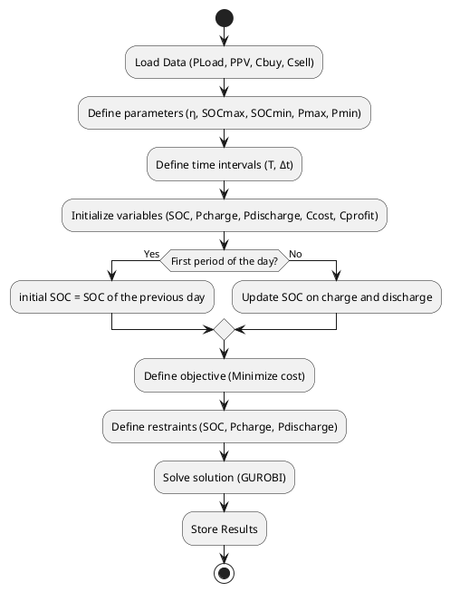
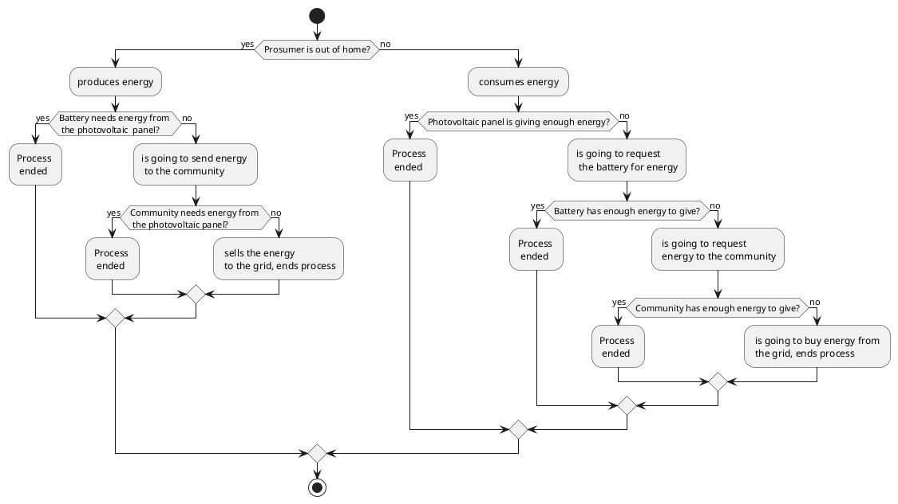
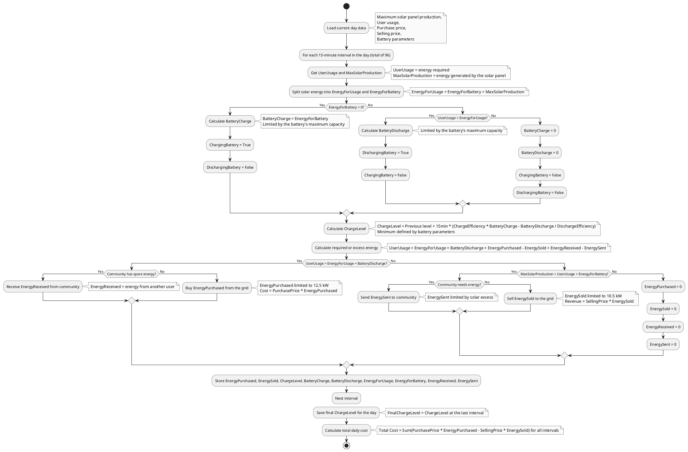
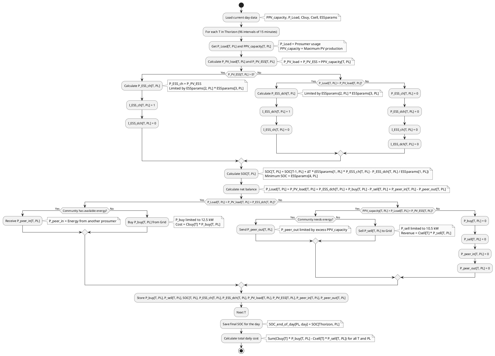
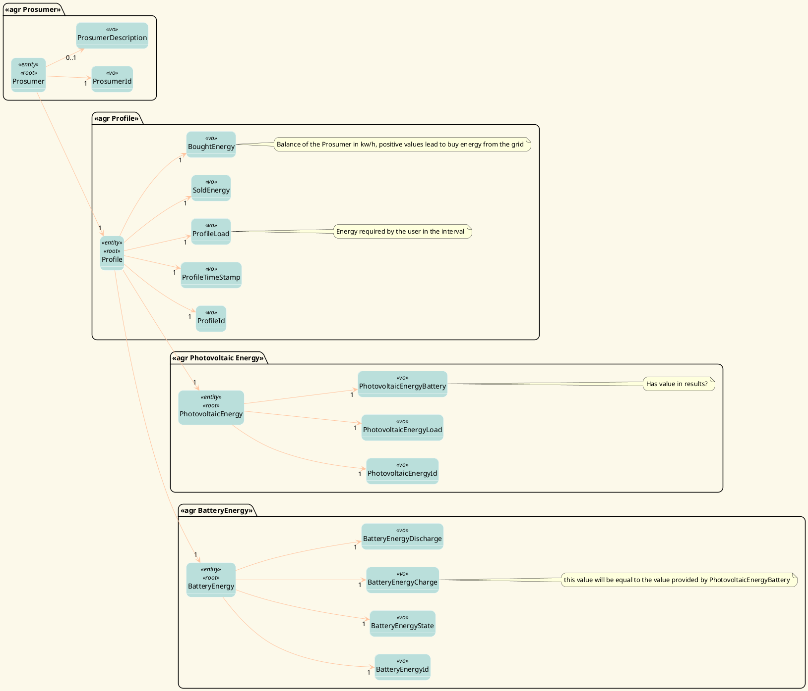
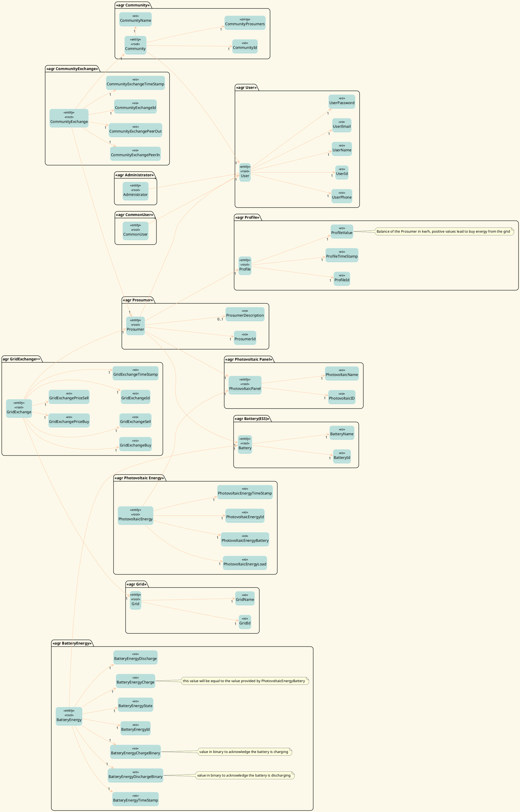
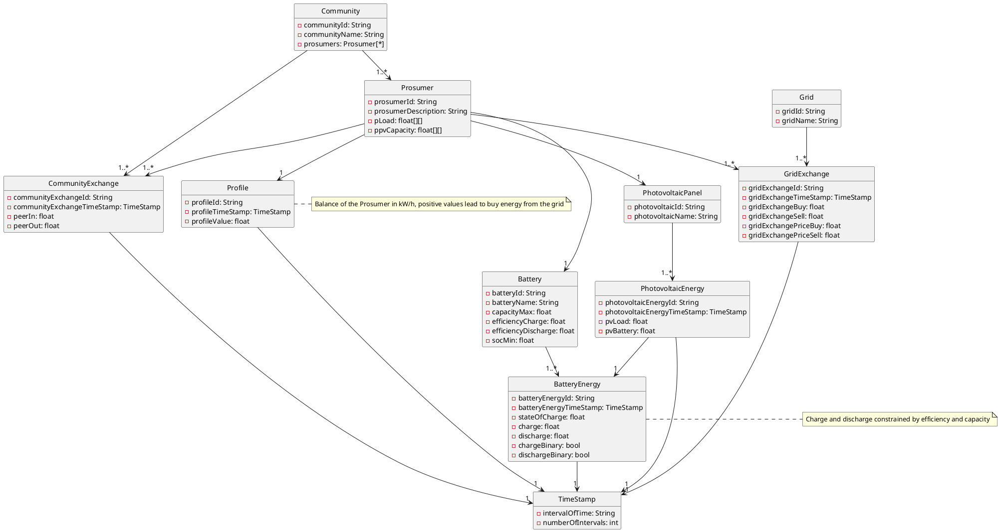

# EnergyComunitiesPlatform 

## Doubts:
Q: How many dataset variations can exist? (Is every dataset a diferent variation or some have the same atributes)
A: Each dataset if diferent but certain atributes represent the same context value so they can be used in the same alghoritm.

Q: What are the minimal files (datasets, program files and ect.) that the system needs to fully operate? 
A: Predefined dataSet (the question would be which atributes are fundamental to the optimization process (same dataSets may variate))

Q: Como funciona o carregamento da bateria quando chega ao limite de charge e discharge
A: Check the fluxogram

## Notes
- Create plots to compare a prosumer inside and outside an energy community
- Study how tax is applied in Spain (sampleData)
- Study how to deploy the optimization algorithm 
- Study which calls the backend has to make to use the O.A

## System Interation:

1º Dataset 

2º Read Datasets 

3º Optimize Data

4º Calculate prices and results

5º Return Arrays with results

## Code Modifications

**Detailed results path changed from absolute to relative**

The use of an absolute path turns the use of the file specific to each computer, so I added the sample data in the project repository so the code can use the path of the file within the repo (relative path). 

satcomm-scen4.py: Line 245

From
~~~
detailed_results_path = r"D:\My Projects\Satcomm project\detailed_results.xlsx"
~~~

To 
~~~
detailed_results_path = r"sampledata.xlsx"
~~~~

sampleData.xlsx: prosumers section


## Interface:
Download the installer at 'https://www.python.org/downloads/' and follow the ins
2º Create an account and Get Academic license for 1 year at https://portal.gurobi.com/iam/licenses/list/

3º Download the gurobi.lic file and follow these instructions:
    #Open Windows PowerShell as an admin (mouse right click)

    # Create folder (in case it doesn't exist)
    mkdir C:\gurobi  

    # Move the license to the correct folder (copy the path of the gurobi.lic downloaded file)
    Move-Item "C:\Users\phenr\Downloads\gurobi.lic" "C:\gurobi\gurobi.lic"

    #Update the ambient variable:
    setx GRB_LICENSE_FILE "C:\gurobi\gurobi.lic"

    #Close the terminal, reopen and run:
    grbprobe

    #It should show the license data

## Install GLPK

**1º** - Download the file 'glpk-4.35.tar.gz' at 'https://ftp.gnu.org/gnu/glpk/'

**2º** - Extract the Zip folder by: right clicking on the folder and then>> 7-Zip >> Extract Here as shown. Move the glpk-4.65 folder from your downloads folder to your C: drive.

**3º** - Assuming you’re using 64-bit Windows, click on the C:\glpk-4.65 folder in Windows explorer, click on the w64 folder, and select and copy the file path, which should be C:\glpk-4.65\w64.

**4º** - Search and open your Control Panel, select System and Security>>System>>Advanced system settings>>Environment Variables. Then click on ‘path’ in the top window, click the ‘Edit’ button, then ‘New’.

**5º** - Paste the file path you copied above and save.

## Install Libraries 
Finally run:

    py satcomm-scen4.py

DONE.

---

## Optimization Algorithm Description

### Variables Mapping

The table below maps the original variables from the code to more comprehensible names, along with their meanings in the context of the energy optimization model:

| **Original Variable**           | **New Name**             | **Meaning**                                          |
|---------------------------------|--------------------------|-----------------------------------------------------|
| `P_Load`                       | `UserDemand`             | Energy required by the user in the interval         |
| `PPV_capacity`                 | `MaxSolarProduction`     | Maximum energy generated by the solar panel         |
| `P_PV_load`                    | `EnergyForDemand`        | Solar energy used directly for demand               |
| `P_PV_ESS`                     | `EnergyForBattery`       | Solar energy used to charge the battery             |
| `P_ESS_ch`                     | `BatteryCharge`          | Energy charged into the battery                     |
| `P_ESS_dch`                    | `BatteryDischarge`       | Energy discharged from the battery                  |
| `I_ESS_ch`                     | `BatteryCharging`        | Indicator that the battery is charging              |
| `I_ESS_dch`                    | `BatteryDischarging`     | Indicator that the battery is discharging           |
| `SOC`                          | `ChargeLevel`            | Current level of energy stored in the battery       |
| `P_buy`                        | `EnergyPurchased`        | Energy purchased from the grid                      |
| `P_sell`                       | `EnergySold`             | Energy sold to the grid                             |
| `P_peer_in`                    | `EnergyReceived`         | Energy received from another user in the community  |
| `P_peer_out`                   | `EnergySent`             | Energy sent to another user in the community        |
| `Cbuy`                         | `PurchasePrice`          | Price per kW/h to buy from the grid                 |
| `Csell`                        | `SellingPrice`           | Price per kW/h to sell to the grid                  |
| `ESSparams[1, PL]`             | `ChargeEfficiency`       | Efficiency when charging the battery                |
| `1/ESSparams[1, PL]`           | `DischargeEfficiency`    | Efficiency when discharging the battery             |
| `ESSparams[2, PL] * ESSparams[3, PL]` | `MaxCapacity`      | Maximum charge/discharge capacity of the battery    |
| `ESSparams[4, PL]`             | `MinLevel`               | Minimum charge level of the battery                 |
| `SOC_end_of_day`               | `FinalChargeLevel`       | Charge level at the end of the day                  |

---

### Fluxogram
Level 1 


Level 2



Level 2B
```plantuml
@startuml
    package "Photovoltaic Panel"{
        object p_pv_load as "Photovoltaic Load"{
            * P_Pv_Load()
        }
    }
    
    package "Prosumer"{
        object P as "Prosumer Load"{
            * P_Load()
        }
    }
   

    package "Battery" {
        object b_ch as "Charge"{
            * Ess_Charge()
        }

        object b_dch as "Discharge"{
            * Ess_Discharge()
        }
    }

    package "Grid" {
        object g_buy as "Buy energy"{
            * P_Buy()
        }
        object g_sell as "Sell energy"{
            * P_Sell()
        }
    }

    package "Community" {
        object peer_out as "Send energy"{
            * Peer_Out()
        }
        object peer_in as "Receive energy"{
            * Peer_In()
        }
    }
    diamond dia1
    diamond dia2
    diamond dia3
    p_pv_load --> P: "Prosumer is consuming energy"
    p_pv_load --> b_ch: "Prosumer is not consuming energy"
    b_dch --> dia1
    peer_out --> dia1
    g_buy --> dia1
    dia1 --> P: "Prosumer needs more energy"
    b_dch --> dia2
    p_pv_load --> dia2
    dia2 --> peer_in: "Community needs energy"
    p_pv_load --> dia3
    b_dch --> dia3
    dia3 --> g_sell: "Best case, nobody needs energy"
@enduml
```

Level 3


Level 3B




## Explanation of the Revised Flowcharts

The revised flowcharts describe the energy management process for a prosumer. Below is a detailed explanation of each step:

### Data Loading
Initial data, such as solar production (`MaxSolarProduction`), user demand (`UserDemand`), purchase and selling prices (`PurchasePrice` and `SellingPrice`), and battery parameters (e.g., `ChargeEfficiency`, `MaxCapacity`), are loaded for the day.

### Loop by Intervals
The process repeats for each 15-minute interval, totaling 96 intervals per day.

### Solar Energy Division
The energy generated by the solar panel (`MaxSolarProduction`) is split between:
- Directly meeting the user’s demand (`EnergyForDemand`).
- Charging the battery (`EnergyForBattery`).

### Battery Management
- **If there is energy for the battery** (`EnergyForBattery > 0`): The battery is charged (`BatteryCharge`), and the `BatteryCharging` indicator is activated.
- **If demand exceeds available energy** (`UserDemand > EnergyForDemand`): The battery is discharged (`BatteryDischarge`), and the `BatteryDischarging` indicator is activated.
- The `ChargeLevel` is updated based on the charging (`BatteryCharge`) and discharging (`BatteryDischarge`) actions, considering efficiencies (`ChargeEfficiency` and `DischargeEfficiency`).

### Energy Balance
Calculates whether there is a need for extra energy or a surplus, using the equation:
- `UserDemand = EnergyForDemand + BatteryDischarge + EnergyPurchased - EnergySold + EnergyReceived - EnergySent`.

### Transactions with Community and Grid
- **Energy Deficit**:
  - Attempts to receive energy from the community (`EnergyReceived`) if available.
  - Otherwise, purchases from the grid (`EnergyPurchased`), with cost calculated as `PurchasePrice * EnergyPurchased`.
- **Energy Surplus**:
  - Sends energy to the community (`EnergySent`) if needed.
  - Otherwise, sells to the grid (`EnergySold`), generating revenue as `SellingPrice * EnergySold`.

### Results
Stores all calculated variables (`EnergyPurchased`, `EnergySold`, `ChargeLevel`, etc.) for analysis. At the end of the day, calculates the total cost/revenue based on prices and transactions.

---


## Preconized Solution

### Use Case Diagram


### Domain Model

DDD based on results




DDD based on sampleData and detailedResults

```plantuml
@startuml DDD

hide circle
hide fields
' ======= layout =========
skinparam backgroundColor #fcf9ea
skinparam titleBorderRoundCorner 15
skinparam titleFontSize 30
skinparam classAttributeIconSize 0
skinparam titleFontName Arial Black
skinparam titleFontColor #f8a978
skinparam roundcorner 20
skinparam stereotypeCBackgroundColor ffc5a1
left to right direction

skinparam class {

ArrowColor ffc5a1
BorderColor White
BackgroundColor badfdb
BackgroundColor<<Event>> skyblue
BackgroundColor<<Service>> Moccasin
}
left to right direction

package "<<agr Prosumer>>"{
    class Prosumer<<entity>><<root>>{}
    class ProsumerId<<vo>>{}
    class ProsumerDescription<<vo>>{}

    Prosumer --> "1" ProsumerId
    Prosumer --> "0..1" ProsumerDescription
    
}

package "<<agr Profile>>"{
    class Profile<<entity>><<root>>{

    }
    class ProfileId<<vo>>{}
    class ProfileTimeStamp<<vo>>{}
    class ProfileValue<<vo>>{} 
    class P_Sell<<vo>>{}
    class P_Buy<<vo>>{}
    note right{
        Balance of the Prosumer in kw/h, positive values lead to buy energy from the grid
    }

    Prosumer --> "1" Profile
    Profile --> "1" ProfileTimeStamp
    Profile --> "1" ProfileId
    Profile --> "1" ProfileValue
}

/' package "<<agr Grid>>"{
    class Grid <<entity>><<root>>{}
    class GridId<<vo>>{}
    class GridName<<vo>>{}

    Grid --> "1" GridId
    Grid --> "1" GridName
}

package "agr GridExchange>>"{
    class GridExchange <<entity>><<root>>{}
    class GridExchangeId<<vo>>{}
    class GridExchangeTimeStamp<<vo>>{}
    class GridExchangeBuy<<vo>>{}
    class GridExchangeSell<<vo>>{}
    class GridExchangePriceBuy<<vo>>{}
    class GridExchangePriceSell<<vo>>{}

    GridExchange ---> "1" Grid
    GridExchange ---> "1" Prosumer
    GridExchange ---> "1" GridExchangeId
    GridExchange ---> "1" GridExchangeTimeStamp
    GridExchange ---> "1" GridExchangeBuy
    GridExchange ---> "1" GridExchangeSell
    GridExchange --> "1" GridExchangePriceBuy
    GridExchange --> "1" GridExchangePriceSell
} '/

/' package "<<agr Community>>"{
    class Community<<entity>><<root>>{

    }
    class CommunityId<<vo>>{}
    class CommunityName<<vo>>{}
    class CommunityProsumers<<array>>{
    }
    Community --> "1" CommunityId
    Community -> "1" CommunityName
    Community --> "1" CommunityProsumers
} '/

/' package "<<agr CommunityExchange>>"{
    class CommunityExchange<<entity>><<root>>{}
    class CommunityExchangeId<<vo>>{}
    class CommunityExchangeTimeStamp<<vo>>{}
    class CommunityExchangePeerIn<<vo>>{}
    class CommunityExchangePeerOut<<vo>>{}

    CommunityExchange --> "1" Community
    CommunityExchange --> "1" Prosumer
    CommunityExchange --> "1" CommunityExchangeId
    CommunityExchange --> "1" CommunityExchangeTimeStamp
    CommunityExchange --> "1" CommunityExchangePeerIn
    CommunityExchange --> "1" CommunityExchangePeerOut
} '/

package "<<agr User>>"{
    class User<<entity>><<root>>{

    }
    class UserId<<vo>>{}
    class UserName<<vo>>{}
    class UserEmail<<vo>>{}
    class UserPassword<<vo>>{}
    class UserPhone<<vo>>{}

    User --> "1" UserId
    User --> "1" UserName
    User --> "1" UserEmail
    User --> "1" UserPassword
    User --> "1" UserPhone
    Community --> "1" User
    Prosumer --> "1" User
}

package "<<agr Administrator>>"{
    class Administrator<<entity>><<root>>{

    }
    Administrator --|> User
   
}

package "<<agr CommonUser>>"{
    class CommonUser<<entity>><<root>>{}
     CommonUser --|> User
}

package "<<agr Photovoltaic Panel>>"{
    class PhotovoltaicPanel<<entity>><<root>>{
    }
    class PhotovoltaicID<<vo>>{}
    class PhotovoltaicName<<vo>>{}

    PhotovoltaicPanel --> "1" PhotovoltaicID
    PhotovoltaicPanel --> "1" PhotovoltaicName
    Prosumer --> "1" PhotovoltaicPanel
}

package "<<agr Photovoltaic Energy>>"{
    class PhotovoltaicEnergy<<entity>><<root>>{}
    class PhotovoltaicEnergyId<<vo>>{}
    /' class PhotovoltaicEnergyTimeStamp<<vo>>{} '/
    class PhotovoltaicEnergyLoad<<vo>>{}
    class PhotovoltaicEnergyBattery<<vo>>{}

    note right of PhotovoltaicEnergyBattery
    Has value in results?
    end note 

    PhotovoltaicEnergy --> "1" PhotovoltaicPanel
    PhotovoltaicEnergy --> "1" PhotovoltaicEnergyId
   /'  PhotovoltaicEnergy --> "1" PhotovoltaicEnergyTimeStamp '/
    PhotovoltaicEnergy --> "1" PhotovoltaicEnergyLoad
    PhotovoltaicEnergy --> "1" PhotovoltaicEnergyBattery
}

package "<<agr Battery(ESS)>>"{
    class Battery<<entity>><<root>>{}
    class BatteryId<<vo>>{}
    class BatteryName<<vo>>{}
    class Eficiency<<vo>>{}
    class MaxChargeDischarge<<vo>>{}
    class 


    Prosumer --> "1" Battery
    Battery --> "1" BatteryId
    Battery --> "1" BatteryName
    


}

package "<<agr BatteryEnergy>>"{
    class BatteryEnergy<<entity>><<root>>{}
    class BatteryEnergyId<<vo>>{}
    class BatteryEnergyState<<vo>>{}
    class BatteryEnergyCharge<<vo>>{}
     note right{
        this value will be equal to the value provided by PhotovoltaicEnergyBattery
    }
    class BatteryEnergyDischarge<<vo>>{}
    /' class BatteryEnergyTimeStamp<<vo>>{} '/
    class BatteryEnergyDischargeBinary<<vo>>{}
     note right{
        boolean value to acknowledge the battery is discharging
    }
    class BatteryEnergyChargeBinary<<vo>>{}
     note right{
        boolean value to acknowledge the battery is charging
    }

    BatteryEnergy ---> "1" Battery
    BatteryEnergy --> "1" BatteryEnergyId
    BatteryEnergy --> "1" BatteryEnergyState
    BatteryEnergy --> "1" BatteryEnergyCharge
    BatteryEnergy --> "1" BatteryEnergyDischarge
    /' BatteryEnergy --> "1" BatteryEnergyTimeStamp '/
    BatteryEnergy --> "1" BatteryEnergyDischargeBinary
    BatteryEnergy --> "1" BatteryEnergyChargeBinary

}
@enduml

```

DDD Original



### Class Diagram

Level 1


Level 2


Level 3



### Components Diagram

Backend


Level 2


Level 3


### Layers Diagram

View


Layout 

