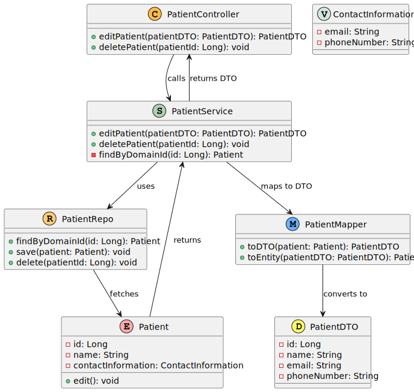

# US 010 - Delete a patient profile

## 1. Requirements Engineering

### 1.1. User Story Description

	As an Admin, I want to delete a patient profile, so that I can remove patients who are no longer under care.

### 1.2. Customer Specifications and Clarifications

	Q: What happens to patient data after the profile is deleted?
	- A: Patient data must be retained for a legally mandated period before being anonymized or deleted.

### 1.3. Acceptance Criteria
 - Admins can search for a patient profile and mark it for deletion.
 - Before deletion, the system prompts the admin to confirm the action.
 - Once deleted, all patient data is permanently removed from the system within a predefined time frame. 
 - The system logs the deletion for audit and GDPR compliance purposes.

### 1.4. Found out Dependencies

- US 008: As an Admin, I want to create a new patient profile, so that I can register their personal details and medical history.
- US 011: As an Admin, I want to list/search patient profiles by different attributes, so that I can view the details, edit, and remove patient profiles.

### 1.5 Input and Output Data

**Typed data**
* Patient id

### 1.6. System Sequence Diagram (SSD)

*Level 1*

*Level 2*

*Level 3*

### 1.7 Other Relevant Remarks

## 2. OO Analysis

### 2.1. Relevant Domain Model Excerpt
*In this section, it is suggested to present an excerpt of the domain model that is seen as relevant to fulfill this requirement.*

### 2.2. Other Remarks

*Use this section to capture some aditional notes/remarks that must be taken into consideration into the design activity. In some case, it might be usefull to add other analysis artifacts (e.g. activity or state diagrams).*

## 3. Design - User Story Realization

### 3.1. Rationale

### Systematization

According to the taken rationale, the conceptual classes promoted to software classes are:

* `Patient`
* `ContactInformation`
* `PatientService`
* `PatientRepo`
* `PatientController`
* `AppointmentHistory`
* `OperationRequest`

Other software classes (i.e. Pure Fabrication) identified:
* `PatientUI`
* `SPAController`

**The rationale grounds on the SSD interactions and the identified input/output data.**

| Interaction ID | Question: Which class is responsible for...             | Answer               | Justification (with patterns)                                   | Pattern Justification                                      |
|:---------------|:--------------------------------------------------------|:---------------------|:----------------------------------------------------------------|:---------------------------------------------------------|
| Step 1         | Handling the request to edit a patient profile?        | `SPA`                | Follows the MVC pattern by handling user interactions.          | **MVC**: The SPA acts as the View in the MVC pattern, managing user interactions and updating the UI. |
| Step 2         | Retrieving the list of patients?                        | `PatientController`  | Controller pattern, responsible for handling requests and responses. | **Controller**: Manages the flow of data between the view (SPA) and the service layer. |
| Step 3         | Fetching patient data from the repository?              | `PatientService`     | Service layer pattern for business logic and data manipulation. | **Service Layer**: Encapsulates business logic and data retrieval processes. |
| Step 4         | Accessing patient data in the database?                 | `PatientRepo`        | Repository pattern, abstracting data access logic.             | **Repository**: Provides an interface to interact with the data source, separating the data access layer from business logic. |
| Step 5         | Sending confirmation for deletion?                       | `SPA`                | Centralizes user interaction before proceeding with deletion.   | **MVC**: The SPA manages user interactions and prompts confirmation before critical actions. |
| Step 6         | Processing the delete request?                           | `PatientController`  | Manages the flow of data and validation for deletion requests.  | **Controller**: Validates and processes user requests, ensuring proper logic flow. |
| Step 7         | Performing the deletion in the service layer?           | `PatientService`     | Ensures separation of concerns by handling business logic.      | **Service Layer**: Encapsulates deletion logic, ensuring single responsibility. |
| Step 8         | Anonymizing patient data before deletion?                | `Patient`            | Encapsulates patient-related data and its behavior.            | **Entity**: Represents the core data and behavior of a patient, maintaining integrity. |
| Step 9         | Logging the deletion for audit purposes?                 | `PatientController`  | Controller also responsible for logging actions for compliance. | **Controller**: Handles logging of actions for audit purposes while managing the flow of requests. |
| Step 10        | Returning success or failure response?                   | `SPA`                | Updates the UI based on the result of the operations.          | **MVC**: The SPA updates the user interface according to the outcomes of the operations. |

## 3.2. Class Diagram (CD)

*In this section, it is suggested to present an UML static view representing the main domain related software classes that are involved in fulfilling the requirement as well as and their relations, attributes and methods.*

# 4. Tests
*In this section, it is suggested to systematize how the tests were designed to allow a correct measurement of requirements fulfilling.*

**_DO NOT COPY ALL DEVELOPED TESTS HERE_**

**Test 1:** Check that it is not possible to create an instance of the Example class with null values.

	@Test(expected = IllegalArgumentException.class)
		public void ensureNullIsNotAllowed() {
		Exemplo instance = new Exemplo(null, null);
	}

*It is also recommended to organize this content by subsections.*

# 5. Construction (Implementation)

*In this section, it is suggested to provide, if necessary, some evidence that the construction/implementation is in accordance with the previously carried out design. Furthermore, it is recommeded to mention/describe the existence of other relevant (e.g. configuration) files and highlight relevant commits.*

*It is also recommended to organize this content by subsections.*

# 6. Integration and Demo

*In this section, it is suggested to describe the efforts made to integrate this functionality with the other features of the system.*

# 7. Observations

*In this section, it is suggested to present a critical perspective on the developed work, pointing, for example, to other alternatives and or future related work.*

