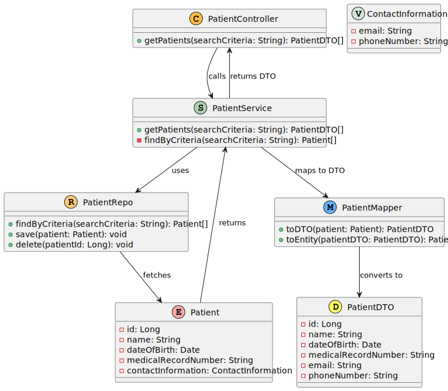

# US 011 -  List/search patient profiles

## 1. Requirements Engineering

### 1.1. User Story Description

As an Admin, I want to list/search patient profiles by different attributes, so that I 
can view the details, edit, and remove patient profiles. 

### 1.2. Customer Specifications and Clarifications

    Q: As discussed in a class, there are plenty of filters for the doctors profiles, however im struggling to see what filters can be applied to the patients profiles listing. They can be searched by name, email, date of birth, or medical record number, but everyone has the same role, no specialization, and so on. Can you be a bit more detailed on the filters you're looking to be applied in the patients listings?
      
    - A: Users should be able to search students by: name, AND/OR email, AND/OR phone number, AND/OR medical record number, AND/OR date of birth, AND/OR gender listing of users should have the same filters available

    Q: Hello Mr. Client. The filters are And or OR. For example, if I filter for a Patient named John and Age 24, do you want every John who is 24 years old or every Patient who is called John or is 24 years old

    - A: If more than one search/filter parameter is used, the combination of filters should be considered as AND.

### 1.3. Acceptance Criteria

- Admins can search patient profiles by various attributes, including name, email, date of birth, 
or medical record number. 

### 1.4. Found out Dependencies

- US 008: As an Admin, I want to create a new patient profile, so that I can register their personal details and medical history.

### 1.5 Input and Output Data

### 1.5 Input and Output Data

**Input Data:**
- **Typed Data:**
  - **searchCriteria**: A string representing the search criteria (e.g., name, email, date of birth, medical record number).
  
- **Selected Data:**
  - **Patient ID**: Selected from the list of patients presented after the search.

**Output Data:**
- **Patient List**: A list of patients that meet the provided search criteria, displaying information such as:
  - **Patient ID**: Unique identifier for the patient.
  - **Name**: Name of the patient.
  - **Date of Birth**: Date of birth of the patient.
  - **Medical Record Number**: Number that identifies the patient's medical record.
  - **Contact Information**: Email and phone number of the patient.

**Example Interaction:**
- The Admin types "Mike Hawk" as the search criteria.
- The system presents a list of patients matching the name, displaying the above information.

### 1.6. System Sequence Diagram (SSD)

*Level 1*

*Level 2*

*Level 3*

### 1.7 Other Relevant Remarks

*Use this section to capture other relevant information that is related with this US such as (i) special requirements ; (ii) data and/or technology variations; (iii) how often this US is held.*

## 2. OO Analysis

### 2.1. Relevant Domain Model Excerpt
*In this section, it is suggested to present an excerpt of the domain model that is seen as relevant to fulfill this requirement.*

### 2.2. Other Remarks

*Use this section to capture some aditional notes/remarks that must be taken into consideration into the design activity. In some case, it might be usefull to add other analysis artifacts (e.g. activity or state diagrams).*

## 3. Design - User Story Realization

### 3.1. Rationale

**The rationale grounds on the SSD interactions and the identified input/output data.**

| Interaction ID | Question: Which class is responsible for...                          | Answer                 | Justification (with patterns)                                 | Pattern Justification                                      |
|:---------------|:-----------------------------------------------------------------------|:-----------------------|:--------------------------------------------------------------|:----------------------------------------------------------|
| Step 1         | Receiving the request to list/search patient profiles                  | `PatientController`    | The controller handles incoming API requests                  | **Controller**: The controller is responsible for handling incoming HTTP requests. |
| Step 2         | Calling the service to get patient profiles                            | `PatientController`    | The controller passes the request to the service layer        | **Controller-Service Interaction**: The controller delegates business logic to the service. |
| Step 3         | Retrieving patient profiles based on search criteria                   | `PatientService`       | The service contains the logic to fetch patients by criteria   | **Service Layer**: Encapsulates business logic and coordinates data retrieval. |
| Step 4         | Querying the repository for patient profiles                            | `PatientRepo`          | The repository provides the method to search by criteria       | **Repository Pattern**: Separates data access logic from business logic. |
| Step 5         | Returning the list of patient profiles to the service                  | `PatientRepo`          | The repository returns the results of the search               | **Repository Pattern**: Facilitates querying and returning data. |
| Step 6         | Returning the list of patients to the controller                       | `PatientService`       | The service returns the list to the controller                 | **Service Layer**: Acts as an intermediary between the controller and the repository. |
| Step 7         | Sending the status code and list of patients to the API                | `PatientController`    | The controller formats the response for the API                | **Controller**: Prepares responses for API consumers. |
| Step 8         | Returning the response to the SPA                                       | `API`                  | The API sends the response back to the SPA                     | **API Layer**: Facilitates communication between client and server. |
| Step 9         | Updating the SPA with the list of patients                             | `SPA`                  | The SPA receives and displays the patient list                  | **Single Page Application**: Dynamically updates the user interface without page reloads. |

### Systematization 

According to the taken rationale, the conceptual classes promoted to software classes are:

* `Patient`
* `PatientDTO`
* `PatientService`

Other software classes (i.e., Pure Fabrication) identified:
* `PatientController`
* `PatientRepo`
* `PatientMapper`

## 3.2. Class Diagram (CD)

# 4. Tests
*In this section, it is suggested to systematize how the tests were designed to allow a correct measurement of requirements fulfilling.*

**_DO NOT COPY ALL DEVELOPED TESTS HERE_**

**Test 1:** Check that it is not possible to create an instance of the Example class with null values.

	@Test(expected = IllegalArgumentException.class)
		public void ensureNullIsNotAllowed() {
		Exemplo instance = new Exemplo(null, null);
	}

*It is also recommended to organize this content by subsections.*

# 5. Construction (Implementation)

*In this section, it is suggested to provide, if necessary, some evidence that the construction/implementation is in accordance with the previously carried out design. Furthermore, it is recommeded to mention/describe the existence of other relevant (e.g. configuration) files and highlight relevant commits.*

*It is also recommended to organize this content by subsections.*

# 6. Integration and Demo

*In this section, it is suggested to describe the efforts made to integrate this functionality with the other features of the system.*

# 7. Observations

*In this section, it is suggested to present a critical perspective on the developed work, pointing, for example, to other alternatives and or future related work.*

