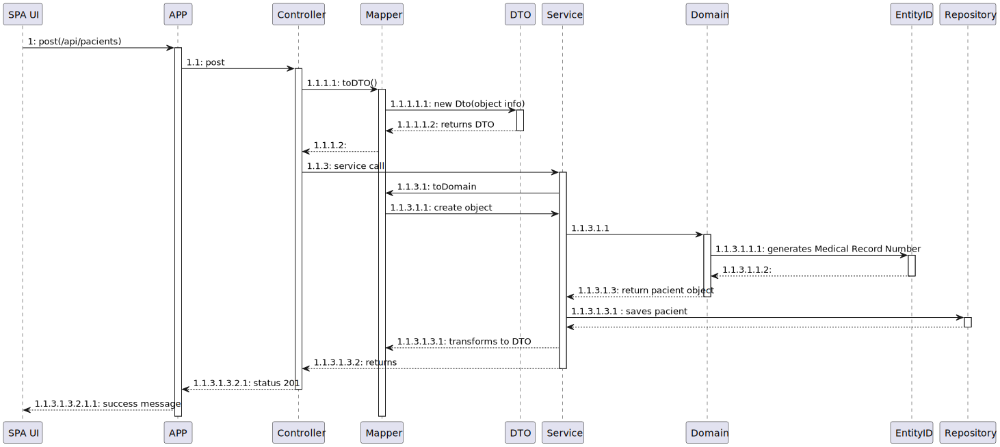

# US 008 - Create a new patient profile

## 1. Requirements Engineering

### 1.1. User Story Description

**US 5.1.8:** As an Admin, I want to create a new patient profile, so that I can register their personal details and medical history.

### 1.2. Customer Specifications and Clarifications

- **Admins** should be able to input patient details such as first name, last name, date of birth, contact information, and medical history.
- A **unique Medical Record Number** must be generated upon profile creation.
- The system should validate that the **email** and **phone number** are **unique**.
- The profile should be stored **securely**, and **access** must be governed by role-based permissions.

### 1.3. Acceptance Criteria

- Admins can input patient details such as first name, last name, date of birth, contact information, and medical history.
- A unique Medical Record Number is generated upon profile creation.
- The system validates that the patient’s email and phone number are unique.
- The profile is securely stored, with role-based access permissions.

### 1.4. Found out Dependencies

- US 012: Creation of a staff profile.
- US 009: Role-based access management.

### 1.5 Input and Output Data

- **Input data**: First name, last name, date of birth, email, regular phone number, emergency phone number, medical history.
- **Output data**: Confirmation of patient creation, unique Medical Record Number.

### 1.6. System Sequence Diagram (SSD)

*Level 1*

*Level 2*

*Level 3*

### 1.7 Other Relevant Remarks

- There should be integration with the permissions system to ensure that only admins can create patient profiles.
- The email and phone number validation must be efficient to avoid duplication.

## 2. OO Analysis

### 2.1. Relevant Domain Model Excerpt

The relevant domain model for this user story includes classes related to the patient, such as:

- **Patient**: Main entity representing the patient.
- **MedicalRecordNumber**: Unique ID generated for the patient.
- **ContactInformation**: Contact information, including email and phone numbers.
- **PatientName**: Value object for the patient's full name.
- **Gender**: Gender representation of the patient.
- **DateOfBirth**: Patient's date of birth.

### 2.2. Other Remarks

- The domain model must ensure data integrity, including email and phone number uniqueness, as well as data security.

## 3. Design - User Story Realization

### 3.1. Rationale

| Interaction ID | Question: Which class is responsible for...           | Answer                | Justification (with patterns)                       |
|----------------|-------------------------------------------------------|-----------------------|----------------------------------------------------|
| Step 1         | Who initiates the profile creation request?            | `SPA UI`              | UI initiates the request via SPA                   |
| Step 2         | Which class handles the HTTP request?                  | `Controller`          | The controller follows the MVC pattern             |
| Step 3         | Which class transforms the request data to DTO?        | `Mapper`              | Mapper converts the received data                  |
| Step 4         | Which class is responsible for the business logic?     | `Service`             | The service contains the business logic            |
| Step 5         | Who generates the unique Medical Record Number?        | `EntityID`            | The ID is generated in the domain layer            |
| Step 6         | Which class saves the patient to the database?         | `Repository`          | The repository saves the patient                   |
| Step 7         | Who returns the response to the UI?                    | `Controller`          | The controller returns the status and response     |

### 3.2. Class Diagram (CD)

## 4. Tests

### Test Cases:

1. **POST /api/patients**: Verifies that a new patient can be created successfully.
   - **Test**: Sends a request with name, email, phone, etc., and checks for a `201 Created` response.
   - **Test**: Validates that the email and phone number are unique and triggers an error in case of duplication.

2. **Validation Tests**:
   - **Test**: Verifies that the system returns an error when trying to register a patient with valid data

            [Fact]
            public async Task Create_ShouldAddPatient_WhenPatientDTOIsValid()
            {
                // Arrange
                var patientDto = new PatientDTO(
                    "MRN123",
                    "11/9/2001",
                    "234567890",
                    "987643210",
                    "patient@example.com",
                    "masculine",
                    "Mike Hawk"
                );

                // Act
                await _patientService.Create(patientDto);

                // Assert
                _patientRepositoryMock.Verify(r => r.AddAsync(It.IsAny<Patient>()), Times.Once);
            }

- **Test**: Verifies that the system returns an error when trying to register a patient with a invalid id.

            [Fact]
            public async Task Create_ShouldThrowException_WhenPatientDTOIsInvalid()
            {
                // Arrange
                var patientDto = new PatientDTO(
                    null, // Valor inválido.
                    "11/9/2001",
                    "234567890",
                    "987654321",
                    "patient@example.com",
                    "masculine",
                    "Mike Hawk"
                );

                // Act & Assert
                await Assert.ThrowsAsync<ArgumentException>(async () => await _patientService.Create(patientDto));
            }

**Integration Tests without Isolation**

    pm.test("Successful POST request", function () {
        pm.expect(pm.response.code).to.equal(201);
    });

    pm.test("Response time is acceptable", function () {
        pm.expect(pm.response.responseTime).to.be.below(1000); // Tempo em milissegundos
    });

    pm.test("Error message is clear and specific", function () {
        if (pm.response.code === 400) {
            const jsonData = pm.response.json();
            pm.expect(jsonData).to.have.property('message');
            pm.expect(jsonData.message).to.equal("Invalid input data.");
        }
    });

    // Teste para garantir que o campo de data de nascimento está no formato correto (dd/mm/yyyy)
    pm.test("Date of birth is in correct format", function () {
        const jsonData = pm.response.json();
        const dateOfBirth = jsonData.dateOfBirth;
        const dateRegex = /^(0?[1-9]|[12][0-9]|3[01])\/(0?[1-9]|1[0-2])\/\d{4}$/; // Regex para dd/mm/yyyy
        pm.expect(dateOfBirth).to.match(dateRegex);
    });

    // Teste para garantir que o campo de e-mail está no formato correto
    pm.test("Email address is in correct format", function () {
        const jsonData = pm.response.json();
        const email = jsonData.emailAdress;
        const emailRegex = /^[^\s@]+@[^\s@]+\.[^\s@]+$/; // Regex para validar e-mail
        pm.expect(email).to.match(emailRegex);
    });

    // Teste para garantir que o número de telefone tem exatamente 9 dígitos
    pm.test("Regular phone number has 9 digits", function () {
        const jsonData = pm.response.json();
        const regularNumber = jsonData.regularNumber;
        const phoneRegex = /^\d{9}$/; // Regex para 9 dígitos numéricos
        pm.expect(regularNumber).to.match(phoneRegex);
    });

    pm.test("Emergency phone number has 9 digits", function () {
        const jsonData = pm.response.json();
        const emergencyNumber = jsonData.emergencyNumber;
        const phoneRegex = /^\d{9}$/; // Regex para 9 dígitos numéricos
        pm.expect(emergencyNumber).to.match(phoneRegex);
    });

    pm.test("Response contains expected properties", function () {
        const jsonData = pm.response.json();
        pm.expect(jsonData).to.have.property('medicalRecordNumber');
        //pm.expect(jsonData).to.have.property('firstName', "jon");
        //pm.expect(jsonData).to.have.property('secondName', "jones");
    });
    /*
    pm.test("Invalid data returns 400", function () {
        pm.sendRequest({
            url: 'http://localhost:5000/api/patients',
            method: 'POST',
            header: {
                'Content-Type': 'application/json'
            },
            body: {
                mode: 'raw',
                raw: JSON.stringify({
                    medicalRecordNumber: "", // ID inválido
                    firstName: "", // Nome inválido
                    lastName: "",
                    regularNumber: "not_a_number", // Formato inválido
                    emailAdress: "not_an_email" // Formato inválido
                })
            }
        }, function (err, res) {
            pm.expect(res.code).to.equal(400);
        });
    });*/

**Test 1.1:** Check if post is successfull

    pm.test("Successful POST request", function () {
        pm.expect(pm.response.code).to.be.oneOf([201, 202]);
    });

**Test 1.2:** Check if Patient contains Name atribute

    pm.test("Response contains created resource", function () {
    const jsonData = pm.response.json();
    pm.expect(jsonData).to.have.property('id'); // Assumindo que o recurso criado terá um ID
    pm.expect(jsonData.name).to.equal("Mike Hawk"); // Validar algum campo
    });

## 5. Construction (Implementation)

- The `/api/patients` endpoint was implemented in the **PatientController**.
- Email and phone validations were handled within the **PatientService**.
- The creation of a `MedicalRecordNumber` was encapsulated in the domain layer.
- Data mapping between DTO and the entity was done by the **PatientMapper**.

## 6. Integration and Demo

- The patient profile creation was integrated with the role-based permissions system.
- The functionality was tested using **Postman** to ensure that email and phone validations are working correctly.

## 7. Observations

- The system could benefit from an additional caching layer to improve the performance of uniqueness validations.
- In a future release, we could integrate a notification service to inform admins when a patient profile is successfully created.
