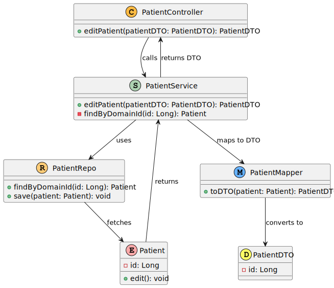

# US 009 - Edit an existing patient profile

## 1. Requirements Engineering

### 1.1. User Story Description

*As an Admin, I want to edit an existing patient profile, so that I can update their 
information when needed.*

### 1.2. Customer Specifications and Clarifications

*No customer specifications nor clarifications*

### 1.3. Acceptance Criteria

Acceptance Criteria: - Admins can search for and select a patient profile to edit. - Editable fields include name, contact information, medical history, and allergies. - Changes to sensitive data (e.g., contact information) trigger an email notification to the patient. - The system logs all profile changes for auditing purposes. 

### 1.4. Found out Dependencies

- US 008: As an Admin, I want to create a new patient profile, so that I can register their personal details and medical history.
- US 011: As an Admin, I want to list/search patient profiles by different attributes, so that I can view the details, edit, and remove patient profiles.

### 1.5 Input and Output Data

**Editable data**
* Name
* Contact Information :
  * Phone Number
  * Email
  * Emergency Contact 
* Medical History
* Allergies

### 1.6. System Sequence Diagram (SSD)

*Level 1*

*Level 2*

*Level 3*

### 1.7 Other Relevant Remarks

## 2. OO Analysis

### 2.1. Relevant Domain Model Excerpt

### 2.2. Other Remarks

*Use this section to capture some aditional notes/remarks that must be taken into consideration into the design activity. In some case, it might be usefull to add other analysis artifacts (e.g. activity or state diagrams).*

## 3. Design - User Story Realization

### 3.1. Rationale

### Systematization ##

According to the taken rationale, the conceptual classes promoted to software classes are:

* **Patient**: Represents the core domain object that holds patient information and behavior related to patient modifications and retrieval.
* **ContactInformation**: Represents the core domain object that holds patient contact information (personal phone number and email).

* **PatientDTO**: A Data Transfer Object used to move patient data between layers without exposing the full domain model.

Other software classes (i.e., Pure Fabrication) identified:
* **PatientUI**: Responsible for presenting and capturing patient data from the user, likely part of the front-end interface (SPA).
* **PatientController**: Receives client requests (e.g., API calls) and interacts with application services or domain logic to process these requests, acting as a bridge between the UI layer and the service layer.
* **PatientService**: Contains the application logic to manage patients, acting as an intermediary between the controller and the domain/repository. It handles data transformations, invokes domain methods, and coordinates the workflow.
* **PatientRepo**: Responsible for persisting and retrieving `Patient` domain objects from the data store, abstracting the database interaction.
* **PatientMapper**: Responsible for transforming domain objects (e.g., `Patient`) into data transfer objects (DTOs) and vice versa, ensuring clean separation between layers.

**The rationale grounds on the SSD interactions and the identified input/output data.**

| Interaction ID | Question: Which class is responsible for...             | Answer             | Justification (with patterns)                                 | Pattern Justification                                    |
|:---------------|:--------------------------------------------------------|:-------------------|:--------------------------------------------------------------|:---------------------------------------------------------|
| Step 1         | Receiving the request to update or patch the patient     | `PatientController` | The controller is the entry point that handles API requests    | **Controller**: The controller is responsible for handling incoming HTTP requests and delegating them to the appropriate service. |
| Step 2         | Calling the service to edit the patient                  | `PatientController` | The controller passes the request to the service layer         | **Controller-Service Interaction**: The controller delegates business logic to the service. |
| Step 3         | Finding the patient by ID                                | `PatientRepo`       | The repository handles the interaction with the data store     | **Repository Pattern**: The repository abstracts data access operations, decoupling the domain from persistence. |
| Step 4         | Editing the patient entity                               | `Patient`           | The patient entity holds the business logic to modify itself   | **Entity (Domain Model)**: The patient object encapsulates business logic related to the patient. |
| Step 5         | Returning the updated patient entity                     | `PatientService`    | The service layer manages the core application logic           | **Application Service Pattern**: Service layer orchestrates domain logic and workflow coordination. |
| Step 6         | Saving the updated patient to the database               | `PatientRepo`       | The repository is responsible for saving entities              | **Repository Pattern**: Handles persistence of entities and abstracts database operations. |
| Step 7         | Mapping the patient entity to a DTO                      | `PatientMapper`     | The mapper converts domain objects to DTOs                     | **Mapper (Data Transfer Pattern)**: A mapper is used to convert entities to DTOs to ensure separation of concerns and avoid exposing domain objects directly. |
| Step 8         | Returning the DTO to the controller                      | `PatientService`    | The service returns the DTO as the output from the business logic | **Application Service Pattern**: The service layer manages the return of processed data in the form of DTOs. |
| Step 9         | Returning a successful response to the API caller        | `PatientController` | The controller handles the HTTP response with appropriate status | **Controller**: The controller is responsible for returning responses to HTTP requests. |
| Step 10        | Sending success response back to the front-end (SPA)     | `API`               | The API layer sends a 201 response with the success message    | **API Layer**: Responsible for communication with the client-side, including returning responses. |

## 3.2. Class Diagram (CD)

# 4. Tests

**Unit tests**

**Test 1.1:** Check that it is possible to update an instance of the Patient class with valid values.

	

		 [Fact]
        public async Task Update_ShouldUpdatePatient_WhenPatientExists()
        {
            // Arrange
            var patientDto = new PatientDTO(
                "MRN123",
                "11/9/2001",
                "234567890",
                "987643210",
                "patient@example.com",
                "masculine",
                "Mike Hawk"
            );
            
            var patient = new Patient(new PatientName("Mike Hawk"), new Gender(GenderEnum.Masculine), 
                new ContactInformation(new EmailAddress("patient@example.com"), new PhoneNumber("987643210")), 
                new PhoneNumber("234567890"), new DateOfBirth("11/9/2001"), new MedicalRecordNumber("MRN123"));
                
            _patientRepositoryMock.Setup(r => r.GetByIdAsync(It.IsAny<MedicalRecordNumber>())).ReturnsAsync(patient);

            // Act
            var result = await _patientService.Update(patientDto);

            // Assert
            _unitOfWorkMock.Verify(u => u.CommitAsync(), Times.Once);
            Assert.True(result.IsSuccess);
        }
		
**Test 1.2:** Check that it is not possible to update an instance of the Example class with null values.

		[Fact]
        public async Task Update_ShouldThrowException_WhenPatientDTOIsInvalid()
        {
            // Arrange
            var patientDto = new PatientDTO(
                "MRN123",
                "11/9/2001",
                "234567890",
                "987643210",
                "patient@example.com",
                "masculine",
                "Mike Hawk"
            );
            
            var patient = new Patient(new PatientName(null), new Gender(GenderEnum.Masculine), 
                new ContactInformation(new EmailAddress("patient@example.com"), new PhoneNumber("987643210")), 
                new PhoneNumber("234567890"), new DateOfBirth("11/9/2001"), new MedicalRecordNumber("MRN123"));
                
            _patientRepositoryMock.Setup(r => r.GetByIdAsync(It.IsAny<MedicalRecordNumber>())).ReturnsAsync(patient);

            // Act
            var result = await _patientService.Update(patientDto);

            // Assert
            _unitOfWorkMock.Verify(u => u.CommitAsync(), Times.Once);
            Assert.False(result.IsSuccess);
        }

**Integration Tests without Isolation**

    pm.test("Successful PUT request", function () {
        pm.expect(pm.response.code).to.equal(200);
    });

    pm.test("Response time is acceptable", function () {
        pm.expect(pm.response.responseTime).to.be.below(1000); // Tempo em milissegundos
    });

    pm.test("Error message is clear and specific", function () {
        if (pm.response.code === 400) {
            const jsonData = pm.response.json();
            pm.expect(jsonData).to.have.property('message');
            pm.expect(jsonData.message).to.equal("Invalid input data.");
        }
    });

    // Teste para garantir que o campo de e-mail está no formato correto
    pm.test("Email address is in correct format", function () {
        const jsonData = pm.response.json();
        const email = jsonData.emailAdress;
        const emailRegex = /^[^\s@]+@[^\s@]+\.[^\s@]+$/; // Regex para validar e-mail
        pm.expect(email).to.match(emailRegex);
    });

    // Teste para garantir que o número de telefone tem exatamente 9 dígitos
    pm.test("Regular phone number has 9 digits", function () {
        const jsonData = pm.response.json();
        const regularNumber = jsonData.regularNumber;
        const phoneRegex = /^\d{9}$/; // Regex para 9 dígitos numéricos
        pm.expect(regularNumber).to.match(phoneRegex);
    });

**Test 1.1:** Check if put is successfull

		pm.test("Successful PUT request", function () {
		pm.expect(pm.response.code).to.equal(200);
		});

**Test 1.2:** Check if Name atribute is updated

		pm.test("Response contains updated resource", function () {
			const jsonData = pm.response.json();
			pm.expect(jsonData.name).to.equal("Mike Updated"); // Validar que o nome foi atualizado
		});

# 5. Construction (Implementation)

*In this section, it is suggested to provide, if necessary, some evidence that the construction/implementation is in accordance with the previously carried out design. Furthermore, it is recommeded to mention/describe the existence of other relevant (e.g. configuration) files and highlight relevant commits.*

*It is also recommended to organize this content by subsections.*

# 6. Integration and Demo

*In this section, it is suggested to describe the efforts made to integrate this functionality with the other features of the system.*

# 7. Observations

*In this section, it is suggested to present a critical perspective on the developed work, pointing, for example, to other alternatives and or future related work.*

