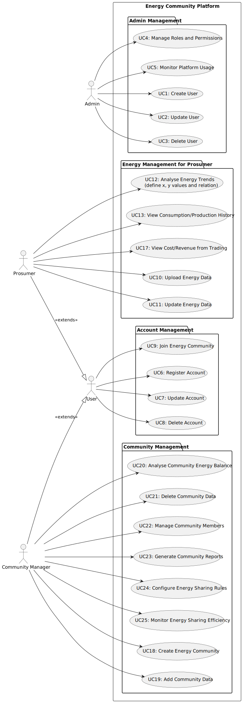
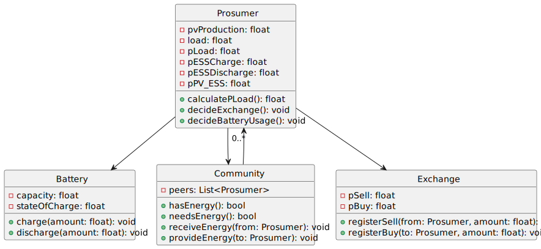

# EnergyComunitiesPlatform 

## 1. Introduction

## 2. Group Members

The members of the group:

| Student Nr.	                     | Name             |
|----------------------------------|------------------|
| 1211664 | Pedro Henrique |
| 1210808 | Gabriel Silva    |
| 1191014 | Rodrigo Silva   |

## 3. Q&A:
Q: How many dataset variations can exist? (Is every dataset a diferent variation or some have the same atributes)
A: Each dataset if diferent but certain atributes represent the same context value so they can be used in the same alghoritm:

- PPV_capacity: Max fotovoltaic energy geration capacity per hour
 
- PL: Load profile of a user along the day 

- buysell: The price of electricity bought from the grid

- buysell: The price of electricity sold to the grid

- ESS-Param: Energy Storage System parameters

Q: Regarding the unused input data in the sampleData file (e.g., Pev, Physical_Distance, EV-Param, etc.), should these be considered for inclusion in the project’s development scope, or should we prioritize building a product based solely on the data and functionality currently utilized by the optimization algorithm?

Q: Will the backend domain model be designed to represent only the results of the optimization algorithm, or should it also include the input data? In other words, are we aiming for a system where the optimization algorithm is accessed solely through APIs, with standardized formats for both input and output data?

Q: In addition to Excel/CSV files, what other methods will the optimization algorithm use to receive data? For example, should it be designed to directly access an organization’s or energy community’s database?

Q: The current algorithm supports multiple prosumers (nPlayers). Should the system be designed with scalability in mind to handle a growing number of prosumers or energy communities, and if so, are there specific performance or capacity targets we should aim for (e.g., maximum number of users, processing time)?

Q: How do you envision end-users interacting with the system? For example, should we include a user interface to input data, view optimization results (e.g., `P_buy`, `P_sell`, `SOC`), or adjust parameters, or will the system primarily operate as a backend service with outputs delivered via files or APIs?

## Notes
- Create plots to compare a prosumer inside and outside an energy community
- Study how tax is applied in Spain (sampleData)
- Study how to deploy the optimization algorithm 
- Study which calls the backend has to make to use the O.A

## System Interation:

1º Dataset 

2º Read Datasets 

3º Optimize Data

4º Calculate prices and results

5º Return Arrays with results

## Code Modifications

**Detailed results path changed from absolute to relative**

The use of an absolute path turns the use of the file specific to each computer, so I added the sample data in the project repository so the code can use the path of the file within the repo (relative path). 

satcomm-scen4.py: Line 245

From
~~~
detailed_results_path = r"D:\My Projects\Satcomm project\detailed_results.xlsx"
~~~

To 
~~~
detailed_results_path = r"sampledata.xlsx"
~~~~

sampleData.xlsx: prosumers section

## Interface:
Download the installer at 'https://www.python.org/downloads/' and follow the ins
2º Create an account and Get Academic license for 1 year at https://portal.gurobi.com/iam/licenses/list/

3º Download the gurobi.lic file and follow these instructions:
    #Open Windows PowerShell as an admin (mouse right click)

    # Create folder (in case it doesn't exist)
    mkdir C:\gurobi  

    # Move the license to the correct folder (copy the path of the gurobi.lic downloaded file)
    Move-Item "C:\Users\phenr\Downloads\gurobi.lic" "C:\gurobi\gurobi.lic"

    #Update the ambient variable:
    setx GRB_LICENSE_FILE "C:\gurobi\gurobi.lic"

    #Close the terminal, reopen and run:
    grbprobe

    #It should show the license data

## Install GLPK

**1º** - Download the file 'glpk-4.35.tar.gz' at 'https://ftp.gnu.org/gnu/glpk/'

**2º** - Extract the Zip folder by: right clicking on the folder and then>> 7-Zip >> Extract Here as shown. Move the glpk-4.65 folder from your downloads folder to your C: drive.

**3º** - Assuming you’re using 64-bit Windows, click on the C:\glpk-4.65 folder in Windows explorer, click on the w64 folder, and select and copy the file path, which should be C:\glpk-4.65\w64.

**4º** - Search and open your Control Panel, select System and Security>>System>>Advanced system settings>>Environment Variables. Then click on ‘path’ in the top window, click the ‘Edit’ button, then ‘New’.

**5º** - Paste the file path you copied above and save.

## Install Libraries 
Finally run:

    py satcomm-scen4.py

DONE.

---

## Optimization Algorithm Description

### Variables Mapping

The table below maps the original variables from the code to more comprehensible names, along with their meanings in the context of the energy optimization model:

| **Original Variable**           | **New Name**             | **Meaning**                                          |
|---------------------------------|--------------------------|-----------------------------------------------------|
| `P_Load`                       | `UserDemand`             | Energy required by the user in the interval         |
| `PPV_capacity`                 | `MaxSolarProduction`     | Maximum energy generated by the solar panel         |
| `P_PV_load`                    | `EnergyForDemand`        | Solar energy used directly for demand               |
| `P_PV_ESS`                     | `EnergyForBattery`       | Solar energy used to charge the battery             |
| `P_ESS_ch`                     | `BatteryCharge`          | Energy charged into the battery                     |
| `P_ESS_dch`                    | `BatteryDischarge`       | Energy discharged from the battery                  |
| `I_ESS_ch`                     | `BatteryCharging`        | Indicator that the battery is charging              |
| `I_ESS_dch`                    | `BatteryDischarging`     | Indicator that the battery is discharging           |
| `SOC`                          | `ChargeLevel`            | Current level of energy stored in the battery       |
| `P_buy`                        | `EnergyPurchased`        | Energy purchased from the grid                      |
| `P_sell`                       | `EnergySold`             | Energy sold to the grid                             |
| `P_peer_in`                    | `EnergyReceived`         | Energy received from another user in the community  |
| `P_peer_out`                   | `EnergySent`             | Energy sent to another user in the community        |
| `Cbuy`                         | `PurchasePrice`          | Price per kW/h to buy from the grid                 |
| `Csell`                        | `SellingPrice`           | Price per kW/h to sell to the grid                  |
| `ESSparams[1, PL]`             | `ChargeEfficiency`       | Efficiency when charging the battery                |
| `1/ESSparams[1, PL]`           | `DischargeEfficiency`    | Efficiency when discharging the battery             |
| `ESSparams[2, PL] * ESSparams[3, PL]` | `MaxCapacity`      | Maximum charge/discharge capacity of the battery    |
| `ESSparams[4, PL]`             | `MinLevel`               | Minimum charge level of the battery                 |
| `SOC_end_of_day`               | `FinalChargeLevel`       | Charge level at the end of the day                  |

---

## Flowcharts

### Flowchart

### Flowchart Level 2

 
### Flowchart Level 2b

### Flowchart Level 3

### Flowchart Level 3b

---

## Explanation of the Revised Flowcharts

The revised flowcharts describe the energy management process for a prosumer. Below is a detailed explanation of each step:

### Data Loading
Initial data, such as solar production (`MaxSolarProduction`), user demand (`UserDemand`), purchase and selling prices (`PurchasePrice` and `SellingPrice`), and battery parameters (e.g., `ChargeEfficiency`, `MaxCapacity`), are loaded for the day.

### Loop by Intervals
The process repeats for each 15-minute interval, totaling 96 intervals per day.

### Solar Energy Division
The energy generated by the solar panel (`MaxSolarProduction`) is split between:
- Directly meeting the user’s demand (`EnergyForDemand`).
- Charging the battery (`EnergyForBattery`).

### Battery Management
- **If there is energy for the battery** (`EnergyForBattery > 0`): The battery is charged (`BatteryCharge`), and the `BatteryCharging` indicator is activated.
- **If demand exceeds available energy** (`UserDemand > EnergyForDemand`): The battery is discharged (`BatteryDischarge`), and the `BatteryDischarging` indicator is activated.
- The `ChargeLevel` is updated based on the charging (`BatteryCharge`) and discharging (`BatteryDischarge`) actions, considering efficiencies (`ChargeEfficiency` and `DischargeEfficiency`).

### Energy Balance
Calculates whether there is a need for extra energy or a surplus, using the equation:
- `UserDemand = EnergyForDemand + BatteryDischarge + EnergyPurchased - EnergySold + EnergyReceived - EnergySent`.

### Transactions with Community and Grid
- **Energy Deficit**:
  - Attempts to receive energy from the community (`EnergyReceived`) if available.
  - Otherwise, purchases from the grid (`EnergyPurchased`), with cost calculated as `PurchasePrice * EnergyPurchased`.
- **Energy Surplus**:
  - Sends energy to the community (`EnergySent`) if needed.
  - Otherwise, sells to the grid (`EnergySold`), generating revenue as `SellingPrice * EnergySold`.

### Results
Stores all calculated variables (`EnergyPurchased`, `EnergySold`, `ChargeLevel`, etc.) for analysis. At the end of the day, calculates the total cost/revenue based on prices and transactions.

---

# Preconized Solution

### Use Cases Diagram

**Level 1 - Version 1**

**Level 1 - Version 2**

**Level 2 - Version 1**

**Level 2 - Version 2**

**Level 3 - Version 1**

**Level 3 - Version 2**

---
## User Stories
**[Work Division](Documentation/WorkDivision.md)**

**[Definition of Ready](Documentation/DoR.md)**

**[Definition of Done](Documentation/DoD.md)**

---

## Domain Model - DDD

### Energy Community DDD

### Results DDD

## Layers

### Layers View

### Layout Layers

## Class Diagrams

### ClassDiagram

### ClassDiagram2

### ClassDiagram3

---

## Component Models

### Components Model BackEnd

### Components Model Level 1

### Components Model Level 2

### Components Model Server

---

## Logical View

### Components Diagram Level 1

### Components Diagram Level 2

### Components Diagram Level 3-EM

---

## Physical View

